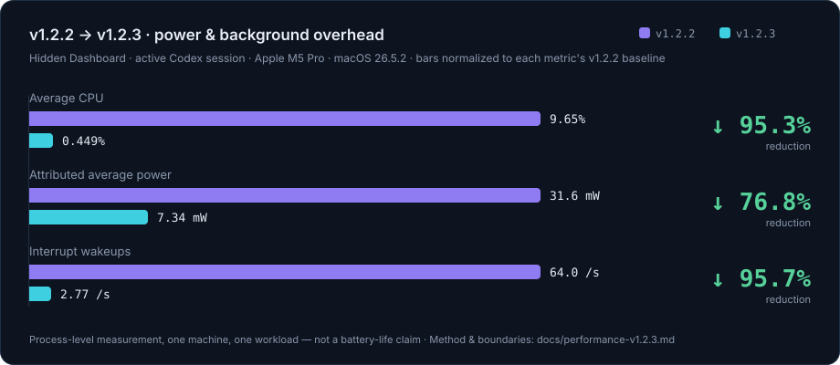
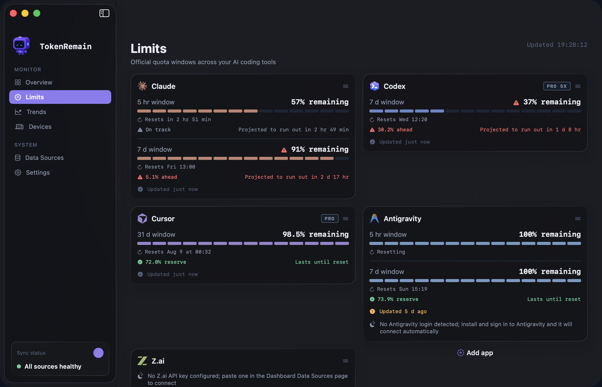
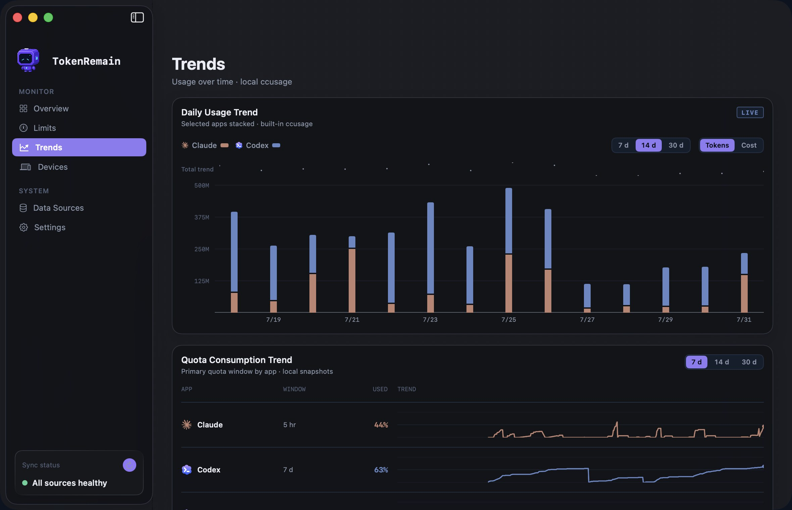
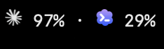
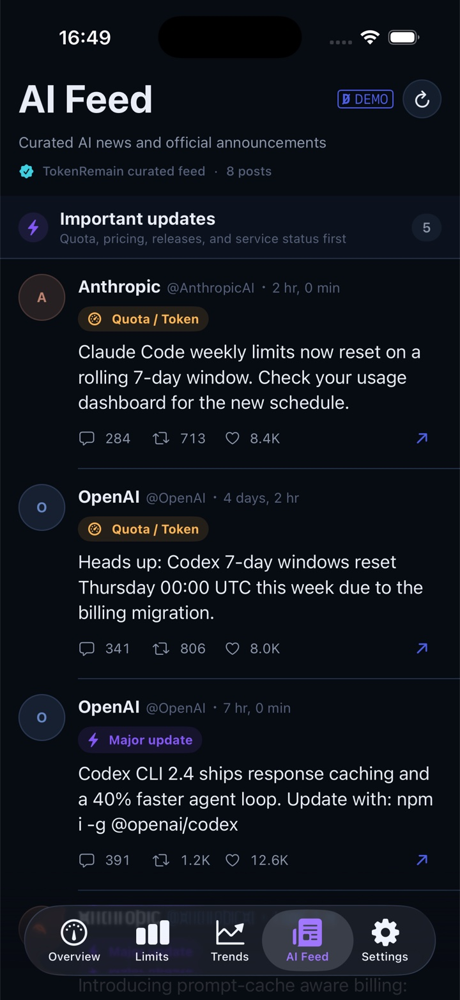
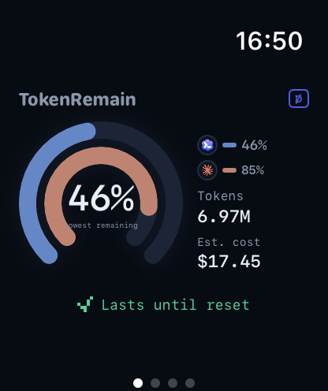
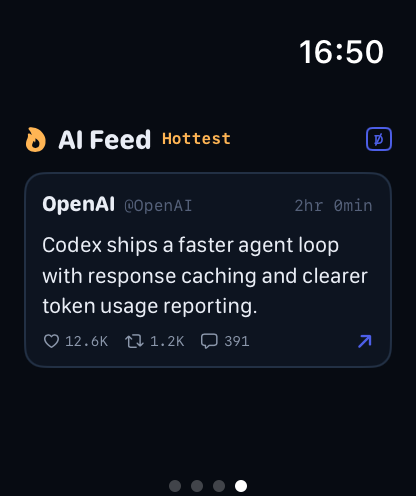

<div align="center">


# TokenRemain

**Your AI quota, always in the Mac menu bar**

Remaining quota, reset countdowns and today's cost for Claude Code, Codex, Cursor, Windsurf, Grok, GLM<br/>and **19+** AI coding tools — all in one place. Credentials stay on your machine: never refreshed, never uploaded.


### [⬇️ Download TokenRemain.dmg](https://tokenremain.com)

<sub>Current release `v1.2.5` · build 19 · Universal Mac Release build</sub>

[Website](https://tokenremain.com) · [Privacy Policy](https://tokenremain.com/privacy) · [Support](https://tokenremain.com/support) · [Report an issue](https://github.com/Carstin520/token-remain/issues)

[简体中文](README.md) · **English**

</div>

---

> **TokenRemain** is the public product name; `UsageDock` is the internal codename in this repo (the download is `TokenRemain.dmg`).
> The app is menu-bar only and shows no Dock icon. Every percentage and progress bar represents **remaining** quota.

## ⚡ v1.2.3: a major power-efficiency release

v1.2.3 is a system-level optimization pass over hidden surfaces and background refreshes — it removes always-on animation, needless background scanning and repeated parsing, not features. In a reproducible stress scenario on an M5 Pro, process CPU dropped **95%**, interrupt wakeups dropped **96%**, and attributed average power dropped **77%**, while keeping minute-level freshness during active sessions, instant manual refresh, cross-device sync and the full foreground experience.

<div align="center">
  
</div>

| Metric | v1.2.2 | v1.2.3 | Change |
| :-- | --: | --: | --: |
| Average CPU | 9.65% | 0.449% | **↓ 95.3%** |
| Attributed average power | 31.6 mW | 7.34 mW | **↓ 76.8%** |
| Interrupt wakeups | 64.0 /s | 2.77 /s | **↓ 95.7%** |

- **Test scenario** — Hidden Dashboard + active Codex session on an Apple M5 Pro running macOS 26.5.2, comparing the public v1.2.2 release against the signed v1.2.3 release. This is a process-level measurement on one machine under one workload — don't convert it into a battery-life claim for every Mac.
- **No features traded away** — Active sessions and visible surfaces keep minute-level refresh, manual refresh stays instant, other providers keep your chosen cadence, and Apple-device sync is preserved. Automated regressions on an isolated source snapshot passed 269 tests (standard) / 282 tests (with cross-device sync enabled) with no P0/P1 regressions found.
- **Method & boundaries** — See [`docs/performance-v1.2.3.md`](docs/performance-v1.2.3.md).

## ✨ What it does

- 🧭 **One unified quota panel** — Claude Code / Codex official 5-hour · 7-day windows with reset countdowns, Cursor's monthly billing cycle, Grok's weekly pool, GLM session/weekly windows — all side by side.
- ⏱️ **Pace prediction** — Real window progress plus official reset times decide whether your current pace lasts until reset, with an ETA when it won't.
- 💰 **Today's cost** — ccusage counts tokens from multiple coding agents locally; OpenClaw and relay model names map back to the corresponding official-model API list price. TokenRemain downloads the complete public price table at most once a day and never uploads local usage details (not a subscription or relay bill).
- 🔐 **Optional encrypted sync publisher** — The Mac remains the only source of real data. When enabled, it writes only an allowlisted, encrypted display snapshot to your own private iCloud database.
- 📡 **AI Feed** — A curated server-side feed of public posts from Anthropic, OpenAI and other official accounts; major updates trigger a local notification.
- 🪟 **Always in reach** — Pick which apps appear in the menu bar, keep a floating window on top across Spaces, refresh every 1/5/15/30 minutes or manually.
- 🎨 **Native feel** — macOS 26 uses system Liquid Glass and the native sidebar; macOS 14/15 falls back to the dark card style.

## 📸 Real screenshots

> Every image below is a live screenshot of the latest build.

### macOS

<table>
  <tr>
    <td align="center" width="62%">
      <br/>
      <sub><b>Dashboard · Overview</b> — today's usage and cost split by provider, with official quota progress and risk hints on the right</sub>
    </td>
    <td align="center" width="38%">
      <br/>
      <sub><b>Menu bar popover</b> — the tightest window, today's cost and the AI feed at a glance</sub>
    </td>
  </tr>
</table>

<table>
  <tr>
    <td align="center" width="50%">
      <br/>
      <sub><b>Dashboard · Limits</b> — every provider's official windows, reset countdowns and pace prediction</sub>
    </td>
    <td align="center" width="50%">
      <br/>
      <sub><b>Dashboard · Trends</b> — token usage and cost history, day by day</sub>
    </td>
  </tr>
</table>

<div align="center">
  <br/>
  <sub><b>Menu bar capsule</b> — choose which apps and remaining percentages stay pinned</sub>
</div>

### iPhone · Apple Watch (encrypted-sync companion)

<table>
  <tr>
    <td align="center" width="27%">
      <br/>
      <sub><b>Overview</b> — aggregates quota snapshots from up to 16 Macs</sub>
    </td>
    <td align="center" width="27%">
      <br/>
      <sub><b>Trends</b> — keep an eye on your pace away from the desk</sub>
    </td>
    <td align="center" width="27%">
      <br/>
      <sub><b>AI Feed</b> — curated official posts with a daily digest</sub>
    </td>
    <td align="center" width="19%">
      <br/>
      <br/>
      <sub><b>Apple Watch</b> — a glance away</sub>
    </td>
  </tr>
</table>

<table>
  <tr>
    <td align="center" width="34%">
      <br/>
      <sub><b>Small widget</b></sub>
    </td>
    <td align="center" width="66%">
      <br/>
      <sub><b>Medium widget</b> — the tightest window, risk badge and reset countdown right on the Home Screen</sub>
    </td>
  </tr>
</table>

> Data is always published one-way and encrypted by the Mac; the mobile client is maintained separately and is outside this repository's open-source scope.

## 🆕 What's new in 1.2

- 🖥️ **Encrypted multi-Mac aggregation** — Every Mac owns an independent, stable private source record; the iPhone can authenticate and combine quota snapshots from up to 16 Macs. One stale, malformed, replayed, or deleted source cannot roll back healthy sources.
- 🧰 **Source management and safe diagnostics** — See each Mac's status on Data Sources, export anonymous field-bounded health/data diagnostics, remove one source, and clearly distinguish disconnecting this Mac from deleting all iCloud sync data.
- 🤖 **Model-level quota windows** — Claude Fable usage and dedicated GPT-5.3-Codex-Spark windows join the detailed quota view and encrypted snapshot; both start hidden and can be enabled independently inside their matching menu-bar quota cards.
- 🖱️ **Direct long-press reordering** — Long-press a Dashboard card to drag it into place with live displacement; lock, pin and expand controls keep their own clickable regions and never get caught by the drag.
- 📊 **More local usage sources** — ccusage dynamically discovers 15+ local agents; Trae reads only timestamps, model names, and token counters from a folder you select; Windsurf adds independent daily/weekly quota with cross-device display support.
- 🔑 **Explicit Keychain consent** — Cross-app read-only access for Claude and Codex begins only from a user action. Background refreshes stay silent and never surprise you with a system authorization prompt.
- ⬆️ **Always update to the latest release** — Adaptive signed-feed checks run about four times a day when current, twice while an update is pending, and use bounded retry backoff after failures. Clicking Update performs a fresh lookup and installs the newest release available then, not merely the version after yours.
- ⚙️ **Session-aware, low-power refreshes** — Local Codex/Claude activity or a genuinely visible surface keeps minute-level freshness; idle, hidden, or fully occluded windows fall back to at least five minutes. Session activity is tracked through filesystem events and timestamp probes, Codex parses only new or rewritten session logs, and the Dashboard robot animation pauses the moment it's hidden. Measured comparison in the [power-efficiency section](#-v123-a-major-power-efficiency-release) above.

## 🔌 Supported services

Most services **connect automatically the moment you're signed in**: TokenRemain only reads credentials that already live on your machine — no extra login inside TokenRemain, no token refreshing. Claude/Codex users can rely on the official desktop apps with no CLI installed; the first cross-app Keychain read is a one-time, user-initiated read-only authorization on the Data Sources page.

### Native providers (11)

| Service | Connection | Notes |
| :-- | :-- | :-- |
|  **Claude Code** | 🟢 Auto | Reads Claude App / Claude Code sign-in credentials; direct `oauth/usage` queries, with a PTY probe fallback only when the CLI is installed |
|  **Codex** | 🟢 Auto | Reads the Keychain credentials maintained by ChatGPT/Codex or a compatible `auth.json`; live server-side 5-hour / 7-day windows |
|  **Cursor** | 🟢 Auto | Monthly billing-cycle quota and reset countdown; read-only queries of `state.vscdb` |
|  **Grok** (xAI) | 🟢 Auto | Weekly pool remaining; reads the Grok CLI's existing credentials |
|  **GitHub Copilot** | 🟢 Auto | Monthly credits; reads your local GitHub sign-in |
|  **Devin** | 🟢 Auto | Daily / weekly quotas |
|  **Windsurf** | 🟢 Auto | Daily / weekly quotas; reads Windsurf's own `state.vscdb` login state read-only |
|  **Antigravity** | 🟢 Auto | Quota pools; reads the local sign-in state |
|  **OpenCode** | 💾 Local only | Go plan usage, estimated from a local database scan — fully offline |
|  **Z.ai** (GLM Coding Plan) | 🔑 API key | Coding Plan session / weekly windows; the key lives only in your Keychain |
|  **OpenRouter** | 🔑 API key | Prepaid credit balance |

> 🟢 **Auto** = connected as soon as the tool is signed in (Claude/Codex work with the official desktop apps — no CLI required) · 🔑 **API key** = paste a key once (stored in the Keychain) · 💾 **Local only** = scans local files, never goes online

### token-monitor compatibility layer (8)

| Service | Connection | | Service | Connection |
| :-- | :-- | :-- | :-- | :-- |
|  **DeepSeek** | API key | |  **Qoder** | Cookie |
|  **Kimi** | API key / kimi-auth cookie | |  **Kiro** | `kiro-cli /usage` parsing |
|  **MiniMax** | API key | |  **Volcengine** | AK:SK signing |
|  **MiMo Code** | Cookie | |  **Ollama** | Session cookie |

### Local token and cost sources

The bundled ccusage collector dynamically discovers Claude Code, Codex,
OpenCode, Amp, Droid, Codebuff, Hermes Agent, pi-agent, Goose, OpenClaw, Kilo
Code, Kimi CLI, Qwen CLI, GitHub Copilot CLI, and Gemini. New sources do not
require fixed database columns, and each discovered source can be included or
excluded from totals on the Data Sources page.

Trae Agent connects through a user-selected `trajectories` folder. TokenRemain
decodes only timestamps, provider/model names, and token counters; prompts,
messages, code, tool arguments, and model responses are ignored. Recognized
hosted models use the official-model API list-price estimate, while explicit
local providers such as Ollama retain zero API cost.

## 🔒 Data and privacy

> Privacy isn't a promise — it's the architecture. Every line below is verifiable in the source.

```
Credentials already on your machine ──read-only──▶ Official provider APIs ──▶ Rendered & cached locally
```

- **Read-only credentials, never refreshed** — Reads the access tokens your tools already maintain (Claude prefers its config file, then the Claude App Keychain; Codex supports both `auth.json` and the Codex Keychain; Cursor read-only from `state.vscdb`; Grok from `~/.grok/auth.json`). Background reads never trigger a system authorization prompt; only clicking "Authorize read-only access" lets macOS show a single confirmation. TokenRemain **never refreshes and never writes back**, so it never fights your tools for their refresh tokens. When the Claude CLI is present, an isolated PTY `/usage` probe serves as a fallback; without it, the app gives direct recovery guidance to sign in or renew through the official app.
- **Manual keys live in the Keychain** — API keys you add by hand (Z.ai, OpenRouter…) are stored only in the macOS Keychain, never in source, build artifacts or logs. Z.ai also accepts the `ZAI_API_KEY` environment variable or `~/.config/zai/key.json`.
- **No credential relay** — Quota queries go straight to each provider's official API. The AI feed, the push service and the anonymous download counter **never receive** provider credentials.
- **No behavioral tracking** — No telemetry, ads, cookies or analytics SDK. The website keeps only one anonymous aggregate Mac download count.
- **Price updates never upload usage** — At most once a day, a fixed bodyless GET downloads the complete public LiteLLM price table. The request carries no credentials, model names, token counts, prompts, projects, conversations, Trae trajectories, or usage history. Prices are cached locally; ccusage and Trae parsing stay local. GitHub may process ordinary connection metadata such as IP address and request time under its policies.
- **No account required** — You never sign up for TokenRemain; being signed in to your local tools is enough.
- **Cache and stats stay local** — Mac caches and cost statistics stay on the machine (`~/Library/Caches/com.jamesli.usagedock/`). Only when you enable sync does an allowlisted, encrypted display snapshot enter your own private iCloud database.

## 📡 AI Feed

`broadcast/` is a Cloudflare Workers + D1 + Queues backend. The first tier collects standalone original and quote posts from `AnthropicAI`, `OpenAI`, `claudeai`, `sama`, `karpathy`, `thsottiaux` and `JensenHuang` every ten minutes (at most 30 per day). The second tier runs hourly and picks standalone original and quote posts only from `Kimi_Moonshot`, `AIatMeta`, `GoogleDeepMind`, `xai`, `MistralAI`, `deepseek_ai`, `OpenRouterAI`, `perplexity_ai`, `simonw`, `emollick`, `ArtificialAnlys` and `elonmusk`, ranked by engagement, account influence and recency (at most 20 per day). Both tiers exclude replies, plain reposts and nullcast posts, and first-tier accounts never re-enter the second tier.

The service exposes `GET /v1/ai-feed` publicly and sends one APNs digest per day in each device's time zone. Users need no account and never see an X API configuration entry point; device registration uses only a random install ID, a device-generated revocation secret and an APNs device token. X credentials, APNs private keys and admin tokens live exclusively in Cloudflare Worker Secrets and are never written into the client or the source. Full contract in [`docs/curated-feed-contract.md`](docs/curated-feed-contract.md) and [`broadcast/README.md`](broadcast/README.md).

## 🚀 Running locally

The menu bar app (internal codename UsageDock):

```bash
bash ./script/build_and_run.sh --verify
```

It installs to `~/Applications/UsageDock.app`. "Launch at login" uses the native macOS login-items API (off by default, toggleable from the menu).

This public repository contains only the TokenRemain macOS desktop client and its required service, website, and release support. Mobile client source is maintained separately and is outside this repository's open-source scope.

## 📁 Repository layout

| Path | Contents |
| :-- | :-- |
| `Sources/UsageDock/` · `Package.swift` | SwiftPM menu bar app (internal codename UsageDock) |
| `Packages/TokenRemainSyncKit/` | Minimal encrypted-sync protocol used by the desktop client |
| `broadcast/` | Cloudflare Workers AI Feed backend (D1 + Queues + APNs) |
| `site/` | Marketing site, privacy policy and support pages |
| `docs/` | Release, privacy and architecture documents |
| `design/` | Brand, palette (`design/palette.md`) and UI sources |
| `script/` | Build, packaging and verification scripts |

## 📦 Current release

- **Version** — `v1.2.5` (build 19), the Universal Mac Release build.
- **Platform** — macOS 14 Sonoma or later on Apple Silicon (arm64) and Intel (x86_64).
- **Distribution** — The website always downloads the latest `TokenRemain.dmg`; each GitHub Release also retains a DMG named with its version and build.
- **Cost figures** — Costs are API list-price estimates, not your subscription bill. When a credential expires, data pauses and the app explains how to restore it.

## 📄 License

Unless otherwise noted, source code and source documentation in this
repository are available under the [Apache License 2.0](LICENSE). The
TokenRemain name, logos, app icons, robot character, screenshots and original
design assets are not included in that grant; read the
[brand and asset licensing terms](ASSET-LICENSE.md) before copying or
redistributing them. Third-party components and provider marks remain subject
to their respective terms.

---

<div align="center">
<sub>

TokenRemain is an independent app, not affiliated with, endorsed by, or sponsored by Anthropic, OpenAI, Anysphere, xAI, GitHub, Zhipu AI, or any other provider; service names and marks appear only to identify the services you can choose to connect.

Publisher and support contact: Dongheng Li · jamescarstin520@gmail.com · © 2026

</sub>
</div>
