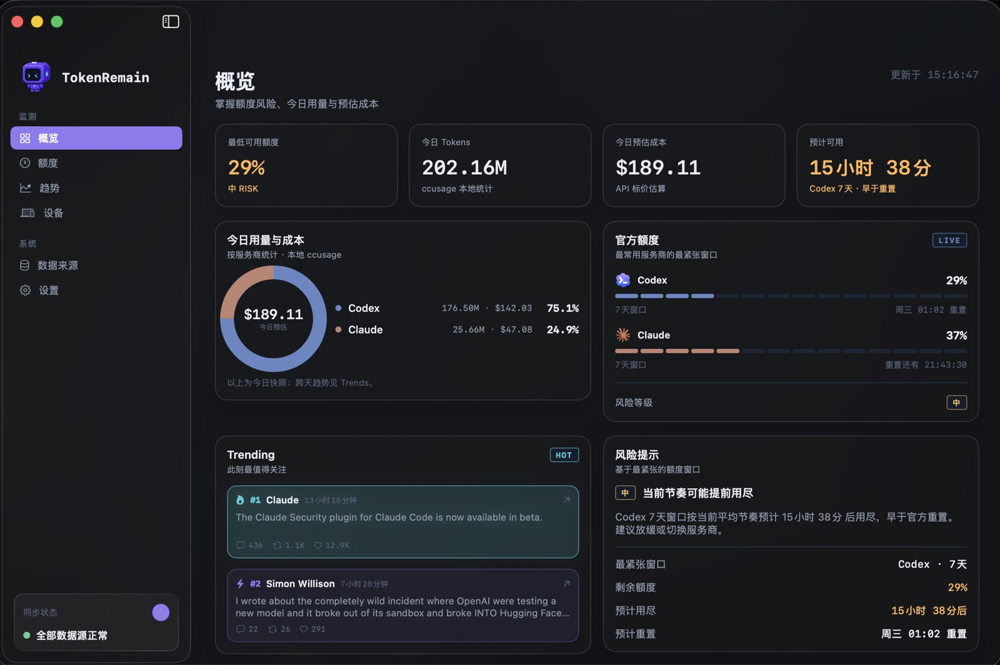
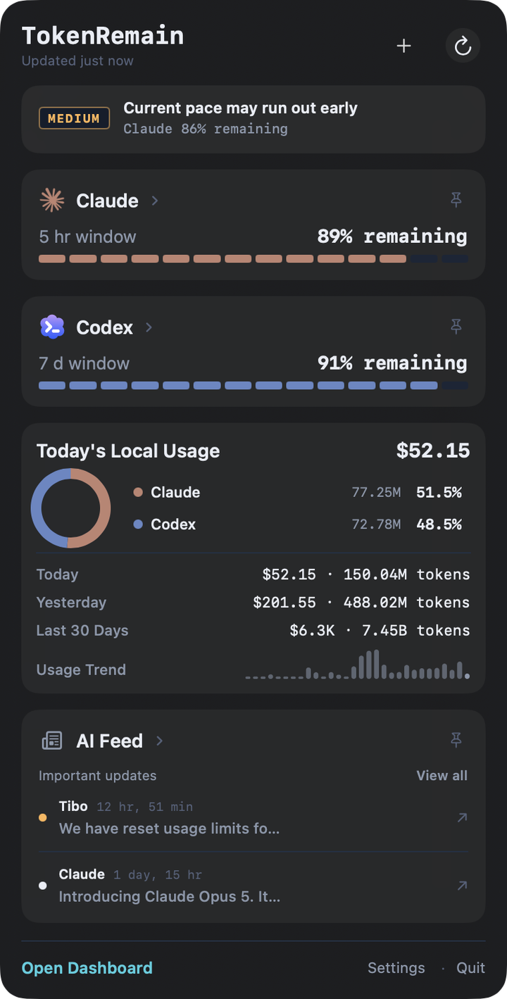
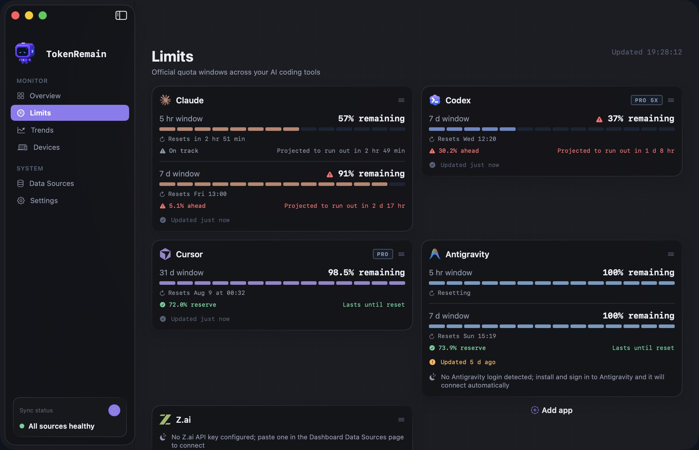
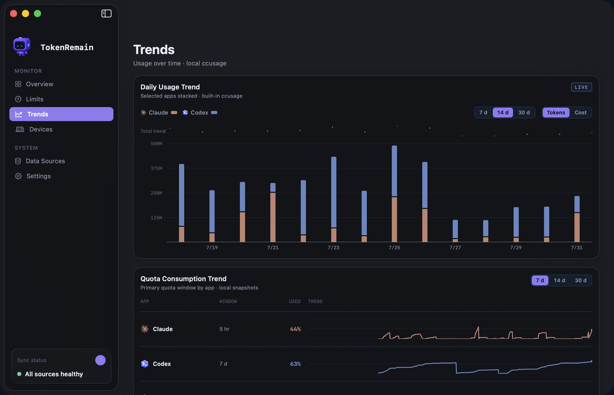
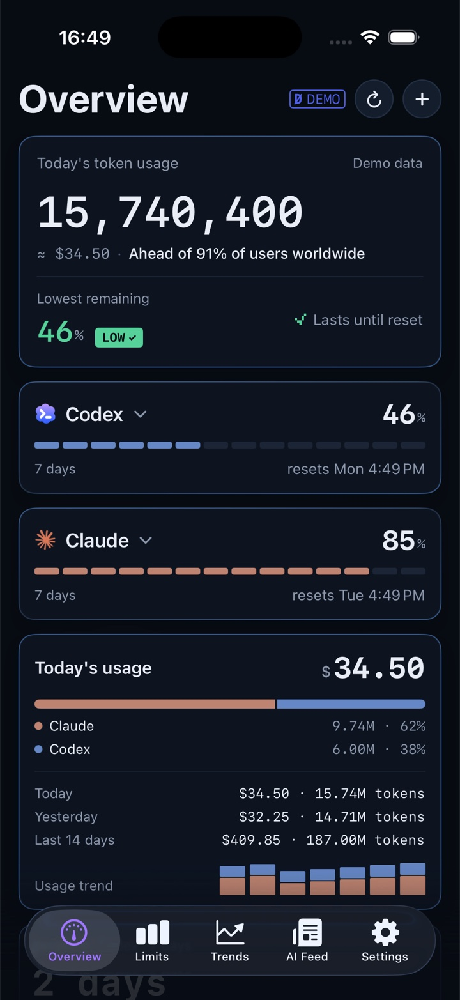
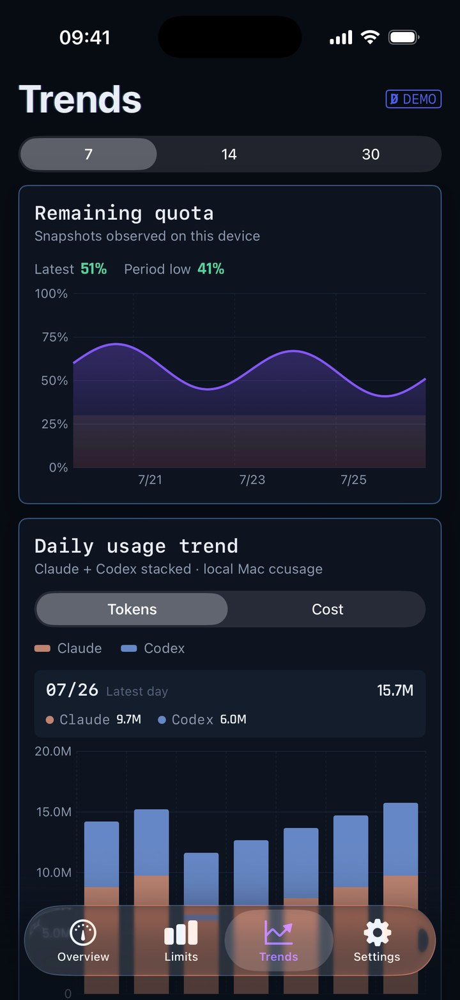
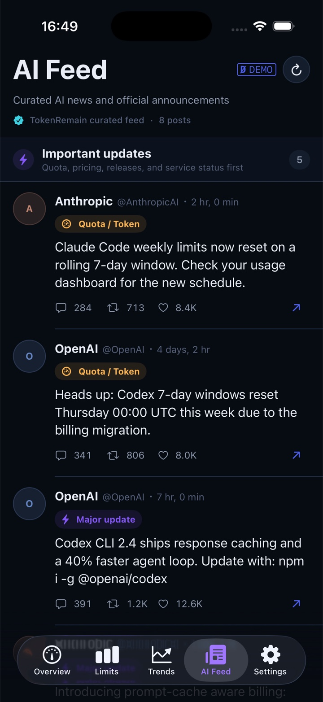
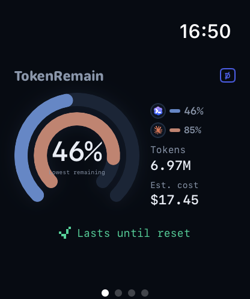
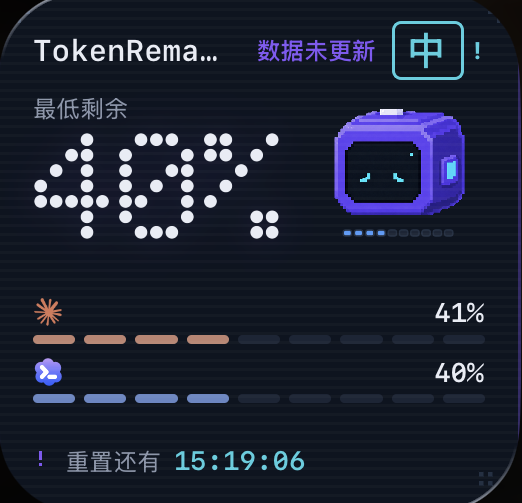
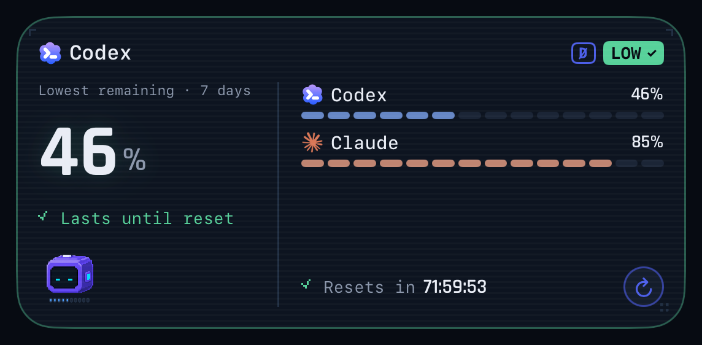

<div align="center">

<a href="https://tokenremain.com"></a>

# TokenRemain

</div>

<h4 align="center">
  <a href="https://tokenremain.com">Website</a> |
  <a href="https://testflight.apple.com/join/DU3DrnhG">iPhone beta</a> |
  <a href="https://tokenremain.com/privacy">Privacy</a> |
  <a href="CHANGELOG.md">Changelog</a> |
  <a href="https://github.com/Carstin520/token-remain/issues">Issues</a> |
  <a href="README.md">简体中文</a>
</h4>

<div align="center">
  <h3>
    Your AI coding quota, always in the Mac menu bar.<br/>
    Credentials never leave your machine: read-only, never refreshed, never uploaded.
  </h3>
</div>

<p align="center">
  <a href="https://github.com/Carstin520/token-remain/releases/latest"></a>
  
  
  <a href="LICENSE"></a>
</p>

<h3 align="center">
  <a href="https://api.tokenremain.com/v1/downloads/macos">⬇️ Download TokenRemain.dmg</a>
</h3>

<p align="center">
  
  
</p>
<p align="center"><sub>Remaining quota, reset countdowns and today's cost for Claude Code, Codex, Cursor, Grok, GLM and 21+ tools — on one screen.</sub></p>

## Features

- 🧭&nbsp;Quota windows from 21+ AI coding tools side by side, with reset countdowns.
- ⏱️&nbsp;Pace prediction: tells you whether your current pace lasts until reset, with an ETA when it won't.
- 💰&nbsp;Today's cost: counts tokens from 15+ coding agents locally, estimated at official API list prices.
- 🔐&nbsp;Reads only credentials already on your Mac — no account, no telemetry, never refreshed, never uploaded.
- 📱&nbsp;Optional encrypted sync to iPhone, Apple Watch and Home Screen widgets.
- 📡&nbsp;AI Feed: curated posts from Anthropic, OpenAI and other official accounts, with local alerts for major updates.
- ⚡&nbsp;Low energy: background CPU down 95% vs v1.2.2 ([method](docs/performance-v1.2.3.md)).
- 🎨&nbsp;Liquid Glass on macOS 26; menu bar capsules and a floating window across Spaces.
- 🌐&nbsp;Localized interface: English, 简体中文, 繁體中文, 日本語, 한국어 and more.

<details>
<summary><b>More screenshots</b> (limits, trends, iPhone and Apple Watch)</summary>
<br/>

<p align="center">
  
  
</p>
<p align="center">
  
  
  
  
</p>
<p align="center">
  
  
</p>

The iPhone app is in [public TestFlight beta](https://testflight.apple.com/join/DU3DrnhG). Data is published one-way and encrypted by the Mac; the mobile client source is outside this repository's open-source scope.

</details>

## Quick start

1. [Download the DMG](https://api.tokenremain.com/v1/downloads/macos), drag TokenRemain into Applications and open it.
2. The welcome screen scans your Mac for installed AI tools — tick the ones to track. TokenRemain reuses each tool's own sign-in, so there's nothing to log into; Claude/Codex work with the official desktop apps, no CLI required.
3. For services that need an API key (Z.ai, OpenRouter, …), paste it straight into that service's quota card, or under "API key settings" on the Data Sources page. Keys stay in your Mac's Keychain.
4. Adjust the quota refresh interval (1–30 minutes or manual) in Settings › Refresh & Sync, and pick which local agents count toward cost on the Data Sources page.

## Supported services

🟢 **Auto** = connected as soon as the tool is signed in · 🔑 **API key** = paste once, stored only in the macOS Keychain

| Service | Connect | What it reads |
| :-- | :-- | :-- |
|  **Claude Code** | 🟢 | 5-hour / 7-day windows; third-party `ANTHROPIC_BASE_URL` attributed to its real API |
|  **Codex** | 🟢 | 5-hour / 7-day windows; custom `base_url` attributed to its real API |
|  **Cursor** | 🟢 | Monthly billing-cycle quota with reset countdown |
|  **Grok** (xAI) | 🟢 | Weekly pool remaining |
|  **GitHub Copilot** | 🟢 | Monthly credits |
|  **Devin** | 🟢 | Daily / weekly quotas |
|  **Windsurf** | 🟢 | Daily / weekly quotas |
|  **Antigravity** | 🟢 | Quota pools |
|  **OpenCode** | 🟢 | Local plan estimate; third-party providers attributed to their real API |
|  **Z.ai** (GLM Coding Plan) | 🔑 | Session / weekly windows plus MCP monthly pool |
|  **OpenRouter** | 🔑 | Key limits, credits and account balance |

<details>
<summary><b>11 more extended providers</b> and local cost sources</summary>
<br/>

| Service | Connection | | Service | Connection |
| :-- | :-- | :-- | :-- | :-- |
|  **DeepSeek** | API key | |  **Qoder** | Cookie |
|  **Kimi** | API key / cookie | |  **Kiro** | `kiro-cli /usage` parsing |
|  **MiniMax** | API key | |  **Volcengine** | AK:SK signing |
|  **MiMo Code** | Cookie | |  **Ollama** | Session cookie |
|  **GLM Team** | API key + org + project | | **Third-party APIs** | New API / custom balance endpoint |
|  **Alibaba Token Plan** | Console cookie | | | |

**How cookie-based services connect:** sign in to the service's website, copy the request Cookie from your browser's developer tools and paste it into that service's quota card (or provide it via `QODER_COOKIE`, `MIMO_COOKIE` or `OLLAMA_COOKIE`). Cookies are stored only in your Mac's Keychain, like API keys; TokenRemain never reads your browser's own cookie store. A cookie is a sign-in credential — never share it; signing out of the website invalidates it, so paste a fresh one afterwards.

**Local cost sources:** the bundled ccusage collector discovers 15+ local agents (Claude Code, Codex, Gemini, Goose, …); Trae contributes only timestamps, model names and token counts from a folder you select. Hosted models use official list-price estimates; local models like Ollama stay at zero cost.

</details>

## Privacy

```
Credentials already on your machine ──read-only──▶ Official provider APIs ──▶ Rendered & cached locally
```

Every claim links to the code or test that backs it:

- **Read-only credentials, never refreshed** — Reads the tokens your tools already maintain, never writes back, never competes for refresh tokens; background reads disable Keychain UI, so no system prompt appears. <sub>🔍 [contract script](script/verify_keychain_read_contract.sh) · [tests](Tests/UsageDockTests/KeychainReadTests.swift#L45) · [source](Sources/UsageDock/Services/ClaudeOAuthUsageService.swift#L9)</sub>
- **Pasted keys stay in the local Keychain** — API keys go into the macOS Keychain and are barred from syncing to iCloud Keychain. <sub>🔍 [source](Sources/UsageDock/Services/KeychainSecretStore.swift#L176) · [tests](Tests/UsageDockTests/AppOwnedKeychainTests.swift#L15)</sub>
- **No account, no telemetry, no credential relay** — Quota queries go straight to each provider's official API; the only dependencies are Sparkle and this repo's sync package, with no analytics SDK. <sub>🔍 [dependencies](Package.swift)</sub>
- **Price updates carry no local data** — At most one GET per day, with no body, query string or auth header, fetches the public LiteLLM price table. <sub>🔍 [tests](Tests/UsageDockTests/CCUsagePricingServiceTests.swift#L19) · [contract script](script/verify_bundled_ccusage_contract.sh#L42)</sub>
- **Sync is off by default and end-to-end encrypted** — When enabled, only an allowlisted display snapshot is AES-GCM encrypted on your Mac, then written to your own private iCloud database. <sub>🔍 [off-by-default test](Tests/UsageDockTests/CrossDeviceSyncDefaultsTests.swift#L8) · [field allowlist](Sources/UsageDock/Sync/MobileSnapshotRedactor.swift#L7) · [encryption](Packages/TokenRemainSyncKit/Sources/TokenRemainSyncKit/EncryptedSyncEnvelope.swift#L66)</sub>

**Other network activity** (never carries credentials or usage): AI Feed fetches public posts from `api.tokenremain.com`; notifications are off by default and register a random install ID only when enabled. Service status reads the public endpoints of `status.openai.com` and `status.claude.com`. Update checks read a signed appcast on GitHub. Direct LAN sync listens on TCP 47831 and accepts only paired devices.

Details in the [privacy policy](https://tokenremain.com/privacy).

## FAQ

<details>
<summary><b>A card says "Login not detected"</b></summary>
<br/>

TokenRemain never refreshes tokens; it only reads the sign-in state each tool saves. Sign in again in that tool and use it once, and the data comes back automatically. Some tools, such as Antigravity, need to be opened and used once before their credentials are written to disk.

</details>

<details>
<summary><b>Claude shows "usage read timed out" or "Claude is unreachable"</b></summary>
<br/>

The card is showing the last good cached snapshot; TokenRemain retries once the network is back and never asks you to sign in over a network failure. The official API follows the system proxy. When an expired credential has to be renewed through the Claude Code CLI, TokenRemain tries, in order: the app's environment variables, the `env` block of Claude Code's `settings.json`, the system proxy (including PAC) and proxy variables exported by your login shell — and uses the first one that reaches `api.anthropic.com`. If it still doesn't recover, run `claude` in a terminal and execute `/usage` once.

</details>

<details>
<summary><b>The top alert and the card show different percentages</b></summary>
<br/>

The alert reflects the tightest of all windows (usually the 7-day one), while the card header shows the 5-hour window — they're not the same window.

</details>

<details>
<summary><b>Today's cost doesn't match my bill</b></summary>
<br/>

Cost is an estimate of local token usage at official API list prices. It shows the scale of your usage, not your subscription bill.

</details>

<details>
<summary><b>A card is labeled "third-party API"</b></summary>
<br/>

When Claude Code has `ANTHROPIC_BASE_URL` set, or Codex has a custom `base_url`, the quota comes from the API actually serving you, and the card names it. If you use the official sign-in and still see this label, please [open an issue](https://github.com/Carstin520/token-remain/issues) with your redacted configuration.

</details>

<details>
<summary><b>How do I uninstall completely?</b></summary>
<br/>

Quit TokenRemain and delete the app, then remove local preferences and caches:

```bash
defaults delete com.jamesli.usagedock
rm -rf ~/Library/Caches/com.jamesli.usagedock ~/Library/Application\ Support/com.jamesli.usagedock
```

Pasted keys can be removed in Keychain Access by searching for `com.jamesli.usagedock`. If you enabled sync and want the iCloud data cleared, [contact support](https://tokenremain.com/support).

</details>

Still stuck? [Open an issue](https://github.com/Carstin520/token-remain/issues) or visit the [support page](https://tokenremain.com/support).

## Contributing

Issues and pull requests are welcome. Build steps, tests, repository layout and conventions are in [CONTRIBUTING.md](CONTRIBUTING.md); please report security issues privately as described in [SECURITY.md](SECURITY.md), not in a public issue.

## Downloads over time

<div align="center">

<picture>
  <source media="(prefers-color-scheme: dark)" srcset="https://api.tokenremain.com/v1/downloads/chart.svg?theme=dark&amp;lang=en" />
  <source media="(prefers-color-scheme: light)" srcset="https://api.tokenremain.com/v1/downloads/chart.svg?theme=light&amp;lang=en" />
  
</picture>

<sub>Starts from 163 historical downloads as of 2026-08-07 ([breakdown](docs/download-baseline.md)) and grows via daily snapshots of an anonymous counter; no personal data involved.</sub>

</div>

## Acknowledgments

- [token-monitor](https://github.com/Javis603/token-monitor) (MIT) — the extended providers' quota readers are ported from this project, which also inspired the floating window and preferences.
- [ccusage](https://github.com/ryoppippi/ccusage) (MIT) — bundled with the app to count local agents' token usage.
- [OpenUsage](https://github.com/robinebers/openusage) (MIT) — reference for the direct Claude quota API provider design.
- [LiteLLM](https://github.com/BerriAI/litellm) — the public model price table.
- [Sparkle](https://github.com/sparkle-project/Sparkle) (MIT) — signed app updates.

Third-party copyright and license notices are in [NOTICE](NOTICE).

## License

Source code and source documentation are available under the [Apache License 2.0](LICENSE); the TokenRemain name, logos, icons, robot character and original design assets are not included — see the [brand and asset licensing terms](ASSET-LICENSE.md).

<sub>TokenRemain is an independent app, not affiliated with, endorsed by, or sponsored by Anthropic, OpenAI, Anysphere, xAI, GitHub, Zhipu AI, or any other provider; service names and marks appear only to identify the services you can choose to connect. Publisher and support contact: Dongheng Li · jamescarstin520@gmail.com · © 2026</sub>
