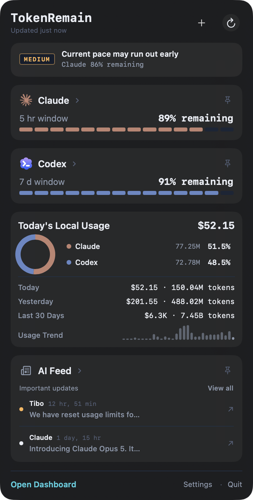
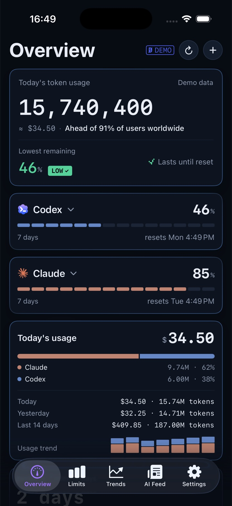
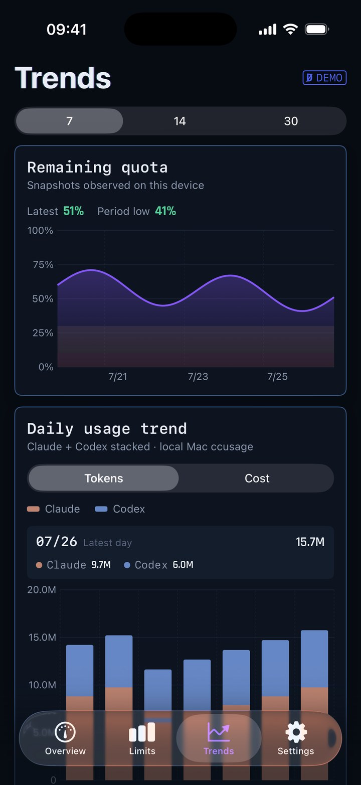
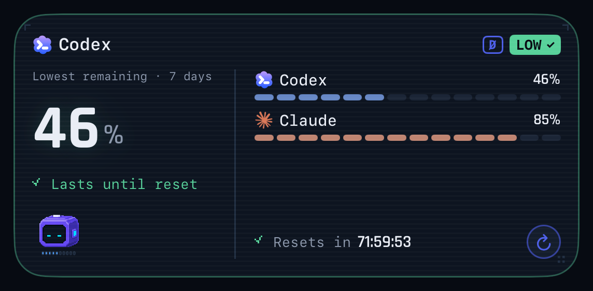
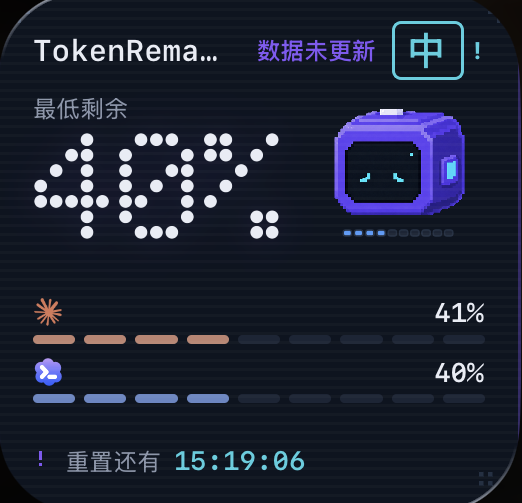

<div align="center">


# TokenRemain

**你的 AI 用量额度，常驻在 Mac 菜单栏**

一个地方查看 Claude Code、Codex、Cursor、Grok、GLM 等 **18+** 家 AI 编码工具的剩余额度、重置倒计时与今日成本。凭证只留在本机，绝不刷新、绝不上传。


**当前最新版本 `v1.1.4`**（build 6，Apple 已公证并装订）

[官网 / 下载](https://tokenremain.com) · [隐私政策](https://tokenremain.com/privacy) · [支持](https://tokenremain.com/support) · [问题反馈](https://github.com/Carstin520/token-remain/issues)

**简体中文** · [English](README.en.md)

</div>

---

> **TokenRemain** 是对外品牌名，`UsageDock` 是仓库内部代号（下载文件名为 `TokenRemain.dmg`）。
> 应用为菜单栏专用，不显示 Dock 图标；所有百分比与进度条都表示**剩余**额度。

## ✨ 能做什么

- 🧭 **统一额度面板** — Claude Code / Codex 的官方 5 小时 · 7 天窗口与重置倒计时，Cursor 月度账期，Grok 周池，GLM 会话/周窗口……全部并排展示。
- ⏱️ **节奏预测** — 结合真实窗口进度与官方重置时间，判断当前节奏能否撑到重置；可能提前用尽时给出预计可用时长。
- 💰 **今日成本** — ccusage 在本地统计 Claude Code / Codex 今日 token 与按 API 标价估算的成本（非订阅账单）。
- 📱 **跨 Apple 设备** — Mac 是唯一真实数据来源；开启同步后，仅一份加密的展示快照经你自己的 iCloud 私有库送到 iPhone / Home Screen 小组件 / Watch。
- 📡 **AI Feed** — 服务端精选 Anthropic、OpenAI 等官方账号的公开动态，重大更新触发本机通知。
- 🪟 **随手可见** — 菜单栏文字自选显示哪些应用、桌面浮窗跨空间置顶、刷新频率 1/5/15/30 分钟或仅手动。
- 🎨 **原生质感** — macOS 26 使用系统 Liquid Glass 与原生侧栏；macOS 14/15 自动回退深色卡片样式。

## 📸 实机截图

> 以下均为最新构建的真实截图。

### macOS

<table>
  <tr>
    <td align="center" width="62%">
      <br/>
      <sub><b>Dashboard · 概览</b> — 今日用量与成本按 provider 拆分，右侧是官方额度进度与风险提示</sub>
    </td>
    <td align="center" width="38%">
      <br/>
      <sub><b>菜单栏弹窗</b> — 一眼看完最紧张的窗口、今日成本与 AI 动态</sub>
    </td>
  </tr>
</table>

### iPhone 与 Home Screen 小组件

<table>
  <tr>
    <td align="center" width="25%">
      <br/>
      <sub><b>iPhone · 概览</b><br/>来自 Mac 的加密快照</sub>
    </td>
    <td align="center" width="25%">
      <br/>
      <sub><b>iPhone · 趋势</b><br/>30 天真实历史</sub>
    </td>
    <td align="center" width="50%">
      <br/>
      <br/>
      <sub><b>桌面小组件</b> — 最低剩余、逐 provider 进度条与重置倒计时</sub>
    </td>
  </tr>
</table>

## 🔌 支持接入的应用

大多数服务**登录即自动接入**：TokenRemain 只读取本机已存在的凭证，无需额外登录、绝不刷新 token。每张卡片都会标注数据来源；未接入的服务会显示具体接入指引。

### 原生 Provider（10 家）

| 应用 | 接入方式 | 说明 |
| :-- | :-- | :-- |
| **Claude Code** | 🟢 自动 | 官方 5 小时 / 7 天窗口与重置倒计时；`oauth/usage` 直查，凭证异常时降级 PTY 探针 |
| **Codex** | 🟢 自动 | 主账户实时 5 小时 / 7 天窗口；服务端直查 + 本地快照兜底；节奏偏快给出提前用尽 ETA |
| **Cursor** | 🟢 自动 | 月度账期额度与重置倒计时；只读 `state.vscdb` |
| **Grok**（xAI）| 🟢 自动 | 周池剩余额度；只读 Grok CLI 凭证 |
| **GitHub Copilot** | 🟢 自动 | 月度 Credits；只读本机 GitHub 登录 |
| **Devin** | 🟢 自动 | 日 / 周配额 |
| **Antigravity** | 🟢 自动 | 配额池；只读本机登录态 |
| **OpenCode** | 💾 纯本地 | Go 套餐用量，本地数据库扫描估算，完全离线 |
| **Z.ai**（GLM Coding Plan）| 🔑 API Key | 会话 / 周窗口；Key 仅存 macOS 钥匙串 |
| **OpenRouter** | 🔑 API Key | 预充积分余额 |

> 🟢 **自动** = 登录对应工具即接入 · 🔑 **API Key** = 需粘贴一次密钥（存钥匙串）· 💾 **纯本地** = 只扫描本地文件，不联网

### token-monitor 兼容层（8 家）

| 应用 | 接入方式 | | 应用 | 接入方式 |
| :-- | :-- | :-- | :-- | :-- |
| **DeepSeek** | API Key | | **Qoder** | Cookie |
| **Kimi** | API Key / kimi-auth Cookie | | **Kiro** | `kiro-cli /usage` 解析 |
| **MiniMax** | API Key | | **火山引擎**（Volcengine）| AK:SK 签名 |
| **MiMo Code** | Cookie | | **Ollama** | session Cookie |

## 🔒 数据与隐私

> 隐私不是一句承诺，而是架构本身 —— 下面每一条都能在源码里核对。

```
你机器上已有的凭证 ──只读──▶ 各服务商官方 API ──▶ 本地渲染并缓存
```

- **只读凭证，绝不刷新** — 读取各工具自己维护的 access token（Claude Code 走 `oauth/usage` 直查，`~/.claude/.credentials.json` 优先、钥匙串兜底；Codex 读 `~/.codex/auth.json`；Cursor 只读 `state.vscdb`；Grok 读 `~/.grok/auth.json`）。**从不刷新、从不写回**，因此不会与工具争用 refresh token，也不会触发续期限流。凭证缺失/过期时自动降级（如 Claude 的隔离 PTY `/usage` 解析、Codex 的会话 rate-limit 快照），恢复后下一轮直查即回正。
- **手动密钥进钥匙串** — Z.ai、OpenRouter 等手动接入的 API Key 只存 macOS 钥匙串，绝不写入源码、构建产物或日志。Z.ai 也支持 `ZAI_API_KEY` 环境变量或 `~/.config/zai/key.json`。
- **不做凭证中转** — 额度查询直连各服务商官方 API；AI Feed、推送服务与匿名下载计数**从不接触** provider 凭证。
- **不做行为追踪** — 无遥测、广告、cookie、分析 SDK；官网只保留一个匿名的 Mac 下载总数。
- **无需账号** — 你从不注册 TokenRemain，本机工具已登录即可。
- **缓存与统计留在本地** — Mac 缓存与成本统计只在本地（`~/Library/Caches/com.jamesli.usagedock/`）；只有开启同步后，一份加密的展示快照才进入你自己的 iCloud 私有库。

## 📡 AI Feed

`broadcast/` 是 Cloudflare Workers + D1 + Queues 后端。第一梯队每十分钟收集 `AnthropicAI`、`OpenAI`、`claudeai`、`sama`、`karpathy`、`btibor91` 的原帖（每天最多 30 条）；第二梯队每小时只从 `Kimi_Moonshot`、`AIatMeta`、`GoogleDeepMind`、`xai`、`MistralAI`、`deepseek_ai`、`OpenRouterAI`、`perplexity_ai`、`simonw`、`emollick`、`ArtificialAnlys`、`elonmusk` 中按互动热度、账号影响力与时效选取原帖（每天最多 20 条）。两层都排除回复、转帖与引用帖，第一梯队账号不会重复进入第二梯队。

服务公开提供 `GET /v1/ai-feed`，并按设备时区每天发送一次 APNs 摘要。用户无需账号，也看不到任何 X API 配置入口；设备注册只用随机安装 ID、设备生成的撤销密钥与 APNs device token。X、APNs 私钥与后台令牌只存在 Cloudflare Worker Secret 中，绝不写入客户端或源码。完整链路见 [`docs/curated-feed-contract.md`](docs/curated-feed-contract.md) 与 [`broadcast/README.md`](broadcast/README.md)。

## 🚀 本地运行

菜单栏 App（内部代号 UsageDock）：

```bash
bash ./script/build_and_run.sh --verify
```

构建完成后安装到 `~/Applications/UsageDock.app`。「登录时自动启动」使用 macOS 原生登录项管理（默认关闭，可在菜单中开启）。

多平台工程（TokenRemain 的 Mac / iPhone / Watch App 与桌面小组件）见 `apple/TokenRemain.xcodeproj`，用 Xcode 打开即可。生产构建默认连接 `https://api.tokenremain.com`，可用 `TOKENREMAIN_BROADCAST_BASE_URL` 覆盖。

## 📁 仓库结构

| 目录 | 内容 |
| :-- | :-- |
| `Sources/UsageDock/` · `Package.swift` | SwiftPM 菜单栏 App（内部代号 UsageDock） |
| `apple/` | Xcode 多平台工程：TokenRemain 的 Mac / iPhone / Watch App 与小组件 |
| `broadcast/` | Cloudflare Workers AI Feed 后端（D1 + Queues + APNs） |
| `site/` | 官网、隐私政策与支持页 |
| `docs/` | 发布、隐私与架构文档 |
| `design/` | 品牌、色板（`design/palette.md`）与 UI 源 |
| `script/` | 构建、打包与校验脚本 |

## 📦 当前发布

- **版本**：`v1.1.4`（build 6）——App 与 DMG 均已 Apple 公证、装订并通过 Gatekeeper 校验。
- **平台**：macOS 14 Sonoma 及以上，仅 Apple Silicon（arm64），暂无 Intel 构建。
- **分发**：公开 DMG 已 Developer ID 签名并经 Apple 公证，目前在 Mac App Store 之外分发；iPhone App Store 产品在开发与发布验证完成后再公布。
- **成本口径**：成本为 API 标价估算，不等于订阅账单；凭证过期时数据会暂停并提示恢复方式。

---

<div align="center">
<sub>

TokenRemain 是独立应用，与 Anthropic、OpenAI、Anysphere、xAI、GitHub、智谱 AI 或任何服务商均无隶属、背书或赞助关系；服务名称与标识仅用于标示你可选择接入的服务。

发布者与支持联系人：Dongheng Li · jamescarstin520@gmail.com · © 2026

</sub>
</div>
