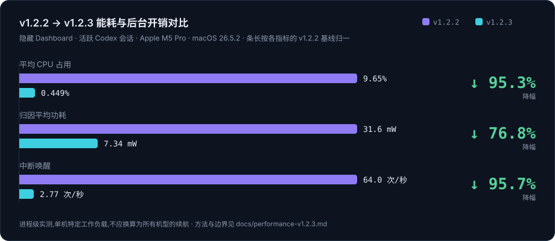

<div align="center">


# TokenRemain

**你的 AI 用量额度,常驻在 Mac 菜单栏**

一个地方查看 Claude Code、Codex、Cursor、Windsurf、Grok、GLM 等 **21+** 家 AI 编码工具的<br/>剩余额度、重置倒计时与今日成本。凭证只留在本机,绝不刷新、绝不上传。


### [⬇️ 下载 TokenRemain.dmg](https://tokenremain.com)

<sub>当前发布 `v1.2.10` · build 24 · Universal Mac Release 构建</sub>

[官网](https://tokenremain.com) · [隐私政策](https://tokenremain.com/privacy) · [支持](https://tokenremain.com/support) · [问题反馈](https://github.com/Carstin520/token-remain/issues)

**简体中文** · [English](README.en.md)

</div>

---

> **TokenRemain** 是对外品牌名,`UsageDock` 是仓库内部代号(下载文件名为 `TokenRemain.dmg`)。
> 应用始终保留菜单栏入口;可在设置中选择显示或隐藏 Dashboard 的 Dock 图标。所有百分比与进度条都表示**剩余**额度。

## ⚡ v1.2.3:一次大幅的能耗优化

v1.2.3 针对隐藏界面与后台刷新做了系统级优化 —— 消除隐藏界面的持续动画、不必要的后台扫描与重复解析,而不是削减功能。在 M5 Pro 的可复现压力场景中,进程 CPU 降低 **95%**,中断唤醒降低 **96%**,归因平均功耗降低 **77%**,同时保持活跃会话下的分钟级数据新鲜度、手动刷新、跨设备同步与完整的前台体验。

<div align="center">
  
</div>

| 指标 | v1.2.2 | v1.2.3 | 变化 |
| :-- | --: | --: | --: |
| 平均 CPU 占用 | 9.65% | 0.449% | **↓ 95.3%** |
| 归因平均功耗 | 31.6 mW | 7.34 mW | **↓ 76.8%** |
| 中断唤醒 | 64.0 次/秒 | 2.77 次/秒 | **↓ 95.7%** |

- **测试场景** — 隐藏 Dashboard + 活跃 Codex 会话,Apple M5 Pro / macOS 26.5.2;对比公开的 v1.2.2 Release 与签名的 v1.2.3 Release。进程级、单机特定工作负载测量,不应换算为所有机型的续航时间。
- **优化不减功能** — 活跃会话与可见界面保持分钟级刷新,手动刷新始终即时,其他 provider 继续遵循用户所选频率,Apple 设备同步保留;隔离源码快照上的自动化回归 269 项(常规)/ 282 项(启用跨设备同步)全部通过,未发现 P0/P1 级功能回归。
- **方法与边界** — 见 [`docs/performance-v1.2.3.md`](docs/performance-v1.2.3.md)。

## ✨ 能做什么

- 🧭 **统一额度面板** — Claude Code / Codex 的官方 5 小时 · 7 天窗口与重置倒计时,Cursor 月度账期,Grok 周池,GLM 会话/周窗口……全部并排展示。
- ⏱️ **节奏预测** — 结合真实窗口进度与官方重置时间,判断当前节奏能否撑到重置;可能提前用尽时给出预计可用时长。
- 💰 **今日成本** — ccusage 在本地统计多种编码 Agent 的 token;OpenClaw / 中转站模型名会映射到对应官方模型 API 标价。TokenRemain 每天最多一次下载完整公开价格表,始终不上传本机用量明细(非订阅或中转站账单)。
- 🔐 **可选加密同步发布器** — Mac 始终是唯一真实数据来源;开启后,只把经过白名单过滤并加密的展示快照写入用户自己的 iCloud 私有库。
- 📡 **AI Feed** — 服务端精选 Anthropic、OpenAI 等官方账号的公开动态,重大更新触发本机通知。
- 🪟 **随手可见** — 菜单栏文字自选显示哪些应用、桌面浮窗跨空间置顶、刷新频率 1/5/15/30 分钟或仅手动。
- 🎨 **原生质感** — macOS 26 使用系统 Liquid Glass 与原生侧栏;macOS 14/15 自动回退深色卡片样式。

## 📸 实机截图

> 以下均为最新构建的真实截图。

### macOS

<table>
  <tr>
    <td align="center" width="62%">
      <br/>
      <sub><b>Dashboard · 概览</b> — 今日用量与成本按 provider 拆分,右侧是官方额度进度与风险提示</sub>
    </td>
    <td align="center" width="38%">
      <br/>
      <sub><b>菜单栏弹窗</b> — 一眼看完最紧张的窗口、今日成本与 AI 动态</sub>
    </td>
  </tr>
</table>

<table>
  <tr>
    <td align="center" width="50%">
      <br/>
      <sub><b>Dashboard · 额度窗口</b> — 每个 provider 的官方窗口、重置倒计时与节奏预测</sub>
    </td>
    <td align="center" width="50%">
      <br/>
      <sub><b>Dashboard · 趋势</b> — 按天回看 token 用量与成本走势</sub>
    </td>
  </tr>
</table>

<div align="center">
  <br/>
  <sub><b>菜单栏胶囊</b> — 自选常驻显示的应用与剩余百分比</sub>
</div>

### iPhone · Apple Watch(加密同步伴侣)

<table>
  <tr>
    <td align="center" width="27%">
      <br/>
      <sub><b>概览</b> — 聚合最多 16 台 Mac 的额度快照</sub>
    </td>
    <td align="center" width="27%">
      <br/>
      <sub><b>趋势</b> — 离开工位也能看节奏</sub>
    </td>
    <td align="center" width="27%">
      <br/>
      <sub><b>AI Feed</b> — 精选官方动态与每日摘要</sub>
    </td>
    <td align="center" width="19%">
      <br/>
      <br/>
      <sub><b>Apple Watch</b> — 抬腕即见</sub>
    </td>
  </tr>
</table>

<table>
  <tr>
    <td align="center" width="34%">
      <br/>
      <sub><b>小号小组件</b></sub>
    </td>
    <td align="center" width="66%">
      <br/>
      <sub><b>中号小组件</b> — 最紧张的窗口、风险标签与重置倒计时直接放上主屏</sub>
    </td>
  </tr>
</table>

> 数据始终由 Mac 单向加密发布;移动客户端独立维护,源码不在本仓库开源范围内。

## 🆕 1.2 版本亮点

- 🖥️ **多 Mac 加密聚合** — 每台 Mac 都拥有独立、稳定的私有来源记录;iPhone 可认证并聚合最多 16 台 Mac 的额度快照。单个来源过期、损坏、重放或删除时,不会拖累其他健康来源。
- 🧰 **来源管理与安全诊断** — 在「数据来源」中查看每台 Mac 的状态,导出经过匿名化和字段限制的健康/数据诊断,单独移除某一来源,并明确区分“断开这台 Mac”与“删除全部 iCloud 同步数据”。
- 🤖 **模型级额度窗口** — Claude Fable 用量与 GPT-5.3-Codex-Spark 独立窗口进入详细额度视图与加密快照;两类模型行默认隐藏,可分别控制是否在对应菜单栏额度组件中显示。
- 🔀 **第三方路由归属** — Claude Code、Codex 与 OpenCode 仍按应用显示；接入 DeepSeek 等第三方 API 时，额度行会标出真正提供余额或限额的 API，不会混用官方订阅快照。
- 🖱️ **长按直接拖拽排序** — Dashboard 卡片长按即可拖动重排并实时位移;锁定、置顶与展开控件保留独立可点击区域,不会被拖拽误触。
- 📊 **更多本地用量来源** — ccusage 动态发现 15+ 种本地 Agent;Trae 只读取用户所选轨迹目录中的时间、模型与 Token 计数;Windsurf 提供独立日/周额度,并支持跨设备展示。
- 🧩 **更细的额度与模型趋势** — GLM Team、New API/自定义余额接口、Antigravity 第三方模型池与 MiniMax 模型级额度独立展示;Dashboard Trends 可查看指定日期的模型 Token/成本及 Input、Output、Cache 构成。
- 🔑 **明确的钥匙串授权** — Claude 与 Codex 的跨 App 只读访问由用户主动触发;后台刷新始终静默,不会突然弹出系统授权窗口。
- ⬆️ **始终更新到最新版** — 自适应检查签名更新源:无更新时每天约四次、有待安装更新时每天约两次,失败后有界退避;用户点击更新时会重新查询最新发布,直接安装当时的最新版本,而不是当前版本的“下一个版本”。
- ⚙️ **会话感知的低功耗刷新** — 本地 Codex/Claude 会话活跃或界面真实可见时保持分钟级新鲜度;静止、隐藏或被完全遮挡时退到至少五分钟。会话活动通过文件系统事件与时间戳探测,Codex 只增量解析新增或改写的会话日志,Dashboard 隐藏即暂停机器人动画。实测对比见上方[「能耗优化」](#-v123一次大幅的能耗优化)一节。

## 🔌 支持接入的应用

大多数服务**登录即自动接入**:TokenRemain 只读取本机已存在的凭证,无需在 TokenRemain 内再次登录、绝不刷新 token。Claude/Codex 用户可以使用官方桌面 App,无需另装 CLI;首次跨 App 读取钥匙串时,可在「数据来源」页主动授权一次只读访问。

### 原生 Provider(11 家)

| 应用 | 接入方式 | 说明 |
| :-- | :-- | :-- |
|  **Claude Code** | 🟢 自动 | 官方登录读取 `oauth/usage`;配置外部 `ANTHROPIC_BASE_URL` 时改读并标注对应 API 余额 |
|  **Codex** | 🟢 自动 | 官方登录读取 5 小时 / 7 天窗口;自定义 `model_provider` / `base_url` 时标注实际 API 来源 |
|  **Cursor** | 🟢 自动 | 月度账期额度与重置倒计时;只读 `state.vscdb` |
|  **Grok**(xAI)| 🟢 自动 | 周池剩余额度;只读 Grok CLI 凭证 |
|  **GitHub Copilot** | 🟢 自动 | 月度 Credits;只读本机 GitHub 登录 |
|  **Devin** | 🟢 自动 | 日 / 周配额 |
|  **Windsurf** | 🟢 自动 | 日 / 周配额;只读 Windsurf 自己的 `state.vscdb` 登录态 |
|  **Antigravity** | 🟢 自动 | 配额池;只读本机登录态 |
|  **OpenCode** | 🟢 自动 | Go 套餐可本地估算;使用已配置的第三方 provider 时读取并标注对应 API 额度 |
|  **Z.ai**(GLM Coding Plan)| 🔑 API Key | Global / 中国区会话、周窗口与 MCP 月额度;Key 仅存 macOS 钥匙串 |
|  **OpenRouter** | 🔑 API Key | Key 限额、预充 Credits、账户余额与官方消费 |

> 🟢 **自动** = 登录对应工具即接入(Claude/Codex 支持官方桌面 App,CLI 非必需)· 🔑 **API Key** = 需粘贴一次密钥(存钥匙串)· 💾 **纯本地** = 只扫描本地文件,不联网

### token-monitor 兼容层(10 家)

| 应用 | 接入方式 | | 应用 | 接入方式 |
| :-- | :-- | :-- | :-- | :-- |
|  **DeepSeek** | API Key | |  **Qoder** | Cookie |
|  **Kimi** | API Key / kimi-auth Cookie | |  **Kiro** | `kiro-cli /usage` 解析 |
|  **MiniMax** | API Key | |  **火山引擎**(Volcengine)| AK:SK 签名 |
|  **MiMo Code** | Cookie | |  **Ollama** | session Cookie |
|  **GLM Team** | API Key + Org + Project | | **第三方 API** | New API / 自定义余额接口 |

### 本地 Token / 成本来源

内置 ccusage 会动态发现 Claude Code、Codex、OpenCode、Amp、Droid、
Codebuff、Hermes Agent、pi-agent、Goose、OpenClaw、Kilo Code、Kimi CLI、
Qwen CLI、GitHub Copilot CLI 与 Gemini。新增来源不会要求扩展固定数据库列,
可在「数据来源」页逐项纳入或排除汇总。

Trae Agent 通过用户选择的 `trajectories` 目录接入;TokenRemain 只解码时间、
provider、模型名和 Token 计数,忽略提示词、消息、代码、工具参数与模型回复。
识别到的托管模型按官方模型 API 标价估算;Ollama 等明确的本地模型保持零 API 成本。

## 🔒 数据与隐私

> 隐私不是一句承诺,而是架构本身 —— 下面每一条都能在源码里核对。

```
你机器上已有的凭证 ──只读──▶ 各服务商官方 API ──▶ 本地渲染并缓存
```

- **只读凭证,绝不刷新** — 读取各工具自己维护的 access token(Claude 优先读配置文件、再读 Claude App 钥匙串;Codex 兼容 `auth.json` 与 Codex Keychain;Cursor 只读 `state.vscdb`;Grok 读 `~/.grok/auth.json`)。后台读取禁止系统授权弹窗;只有用户点击「授权只读访问」才允许 macOS 显示一次确认。TokenRemain **从不刷新、从不写回**,因此不会与工具争用 refresh token。Claude CLI 存在时可使用隔离 PTY `/usage` 兜底;没有 CLI 时直接给出打开官方 App 登录或续期的恢复指引。
- **手动密钥进钥匙串** — Z.ai、OpenRouter 等手动接入的 API Key 只存 macOS 钥匙串,绝不写入源码、构建产物或日志。Z.ai 也支持 `ZAI_API_KEY` 环境变量或 `~/.config/zai/key.json`。
- **不做凭证中转** — 额度查询直连各服务商官方 API;AI Feed、推送服务与匿名下载计数**从不接触** provider 凭证。
- **不做行为追踪** — 无遥测、广告、cookie、分析 SDK;官网只保留一个匿名的 Mac 下载总数。
- **价格更新不上传用量** — 每天最多一次以固定、无请求正文的 GET 下载完整 LiteLLM 公开价格表;请求不携带凭证、模型名、token 数、提示词、项目、对话、Trae 轨迹或用量历史。价格缓存在本机,ccusage 与 Trae 解析仍在本地完成。GitHub 可能按其政策处理 IP 与请求时间等普通连接元数据。
- **无需账号** — 你从不注册 TokenRemain,本机工具已登录即可。
- **缓存与统计留在本地** — Mac 缓存与成本统计只在本地(`~/Library/Caches/com.jamesli.usagedock/`);只有开启同步后,一份加密的展示快照才进入你自己的 iCloud 私有库。

## 📡 AI Feed

`broadcast/` 是 Cloudflare Workers + D1 + Queues 后端。第一梯队每十分钟收集 `AnthropicAI`、`OpenAI`、`claudeai`、`sama`、`karpathy`、`thsottiaux`、`JensenHuang` 的独立原帖与引用帖(每天最多 30 条);第二梯队每小时只从 `Kimi_Moonshot`、`AIatMeta`、`GoogleDeepMind`、`xai`、`MistralAI`、`deepseek_ai`、`OpenRouterAI`、`perplexity_ai`、`simonw`、`emollick`、`ArtificialAnlys`、`elonmusk` 中按互动热度、账号影响力与时效选取独立原帖和引用帖(每天最多 20 条)。两层都继续排除回复、纯转帖和 nullcast,第一梯队账号不会重复进入第二梯队。

服务公开提供 `GET /v1/ai-feed`,并按设备时区每天发送一次 APNs 摘要。用户无需账号,也看不到任何 X API 配置入口;设备注册只用随机安装 ID、设备生成的撤销密钥与 APNs device token。X、APNs 私钥与后台令牌只存在 Cloudflare Worker Secret 中,绝不写入客户端或源码。完整链路见 [`docs/curated-feed-contract.md`](docs/curated-feed-contract.md) 与 [`broadcast/README.md`](broadcast/README.md)。

## 🚀 本地运行

菜单栏 App(内部代号 UsageDock):

```bash
bash ./script/build_and_run.sh --verify
```

构建完成后安装到 `~/Applications/UsageDock.app`。「登录时自动启动」使用 macOS 原生登录项管理(默认关闭,可在菜单中开启)。

本公开仓库只包含 TokenRemain 的 macOS Desktop 客户端及其必要的服务、网站和发布支持;移动客户端源码独立维护,不属于本仓库的开源范围。

## 📁 仓库结构

| 目录 | 内容 |
| :-- | :-- |
| `Sources/UsageDock/` · `Package.swift` | SwiftPM 菜单栏 App(内部代号 UsageDock) |
| `Packages/TokenRemainSyncKit/` | Desktop 使用的最小加密同步协议包 |
| `broadcast/` | Cloudflare Workers AI Feed 后端(D1 + Queues + APNs) |
| `site/` | 官网、隐私政策与支持页 |
| `docs/` | 发布、隐私与架构文档 |
| `design/` | 品牌、色板(`design/palette.md`)与 UI 源 |
| `script/` | 构建、打包与校验脚本 |

## 📦 当前发布

- **版本**:`v1.2.10`(build 24)——Universal Mac Release 构建。
- **平台**:macOS 14 Sonoma 及以上,同时支持 Apple Silicon(arm64)与 Intel(x86_64)。
- **分发**:官网始终下载最新的 `TokenRemain.dmg`;GitHub Release 同时保留带版本与 build 号的 DMG 归档。
- **成本口径**:成本为 API 标价估算,不等于订阅账单;凭证过期时数据会暂停并提示恢复方式。

## 📄 开源许可

除另有说明外,本仓库的源代码与源文档采用
[Apache License 2.0](LICENSE) 开源。TokenRemain 名称、Logo、App 图标、机器人形象、
截图与原创设计素材不包含在该授权中;复制或分发前请阅读
[品牌与素材许可说明](ASSET-LICENSE.md)。第三方组件与服务商标识继续适用各自的许可与权利声明。

---

<div align="center">
<sub>

TokenRemain 是独立应用,与 Anthropic、OpenAI、Anysphere、xAI、GitHub、智谱 AI 或任何服务商均无隶属、背书或赞助关系;服务名称与标识仅用于标示你可选择接入的服务。

发布者与支持联系人:Dongheng Li · jamescarstin520@gmail.com · © 2026

</sub>
</div>
