<div align="center">


# TokenRemain

**你的 AI 用量额度,常驻在 Mac 菜单栏**

一个地方查看 Claude Code、Codex、Cursor、Windsurf、Grok、GLM 等 **21+** 家 AI 编码工具的<br/>剩余额度、重置倒计时与今日成本。凭证只留在本机,绝不刷新、绝不上传。


### [⬇️ 下载 TokenRemain.dmg](https://tokenremain.com)

<sub>`v1.3.7` · build 34 · Universal(Apple Silicon + Intel)· macOS 14+</sub>

[官网](https://tokenremain.com) · [隐私政策](https://tokenremain.com/privacy) · [支持](https://tokenremain.com/support) · [问题反馈](https://github.com/Carstin520/token-remain/issues) · [更新记录](CHANGELOG.md)

**简体中文** · [English](README.en.md)

</div>

---

## ✨ 能做什么

- 🧭 **统一额度面板** — Claude/Codex 官方 5 小时·7 天窗口、Cursor 月度账期、Grok 周池、GLM 会话/周窗口,并排展示、倒计时重置。
- ⏱️ **节奏预测** — 按真实窗口进度判断当前节奏能否撑到重置,撑不到时给出预计可用时长。
- 💰 **今日成本** — ccusage 在本地统计 15+ 种编码 Agent 的 token,按官方 API 标价估算(非订阅账单),用量明细绝不上传。
- 🔐 **可选加密同步** — 开启后仅把加密展示快照写入你自己的 iCloud 私有库,iPhone / Apple Watch 随时查看。
- 📡 **AI Feed** — 服务端精选 Anthropic、OpenAI 等官方账号动态,重大更新触发本机通知。
- ⚡ **极低能耗** — 后台 CPU 降低 95%、归因功耗降低 77%,数据新鲜度不变([测试方法与边界](docs/performance-v1.2.3.md))。
- 🎨 **原生质感** — macOS 26 Liquid Glass;菜单栏胶囊、跨空间浮窗,刷新频率 1–30 分钟或仅手动。

## 📸 实机截图

<table>
  <tr>
    <td align="center" width="62%">
      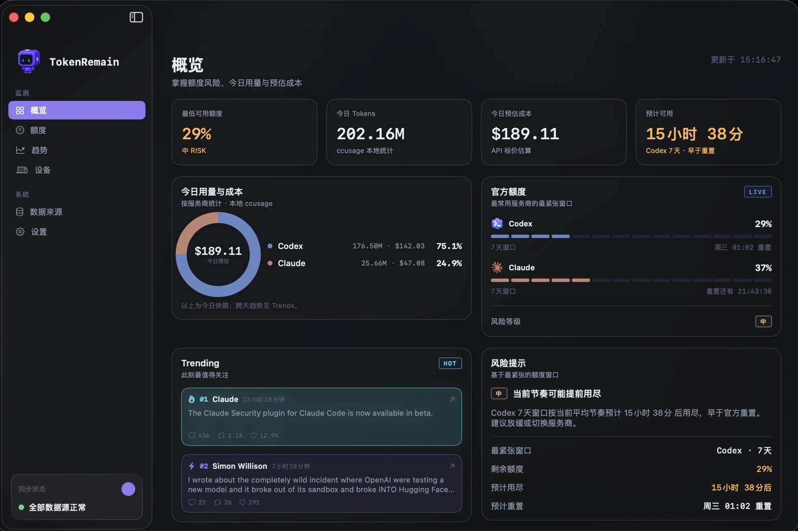<br/>
      <sub><b>Dashboard · 概览</b></sub>
    </td>
    <td align="center" width="38%">
      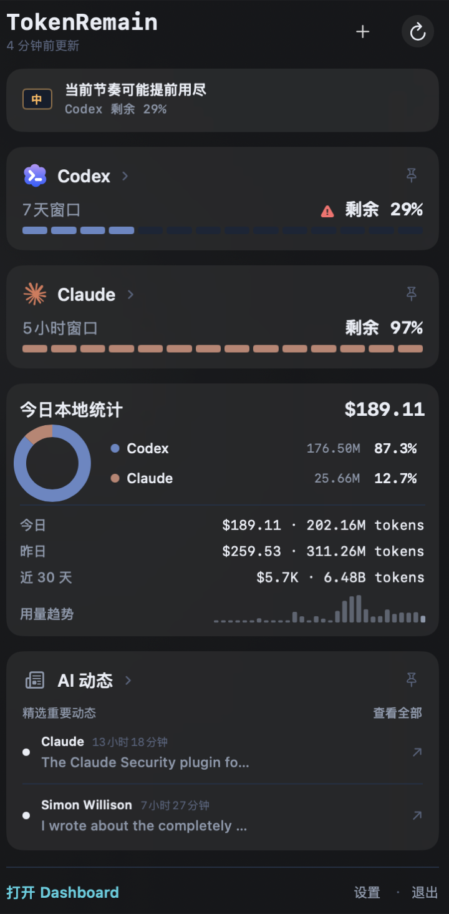<br/>
      <sub><b>菜单栏弹窗</b></sub>
    </td>
  </tr>
</table>

<table>
  <tr>
    <td align="center" width="50%">
      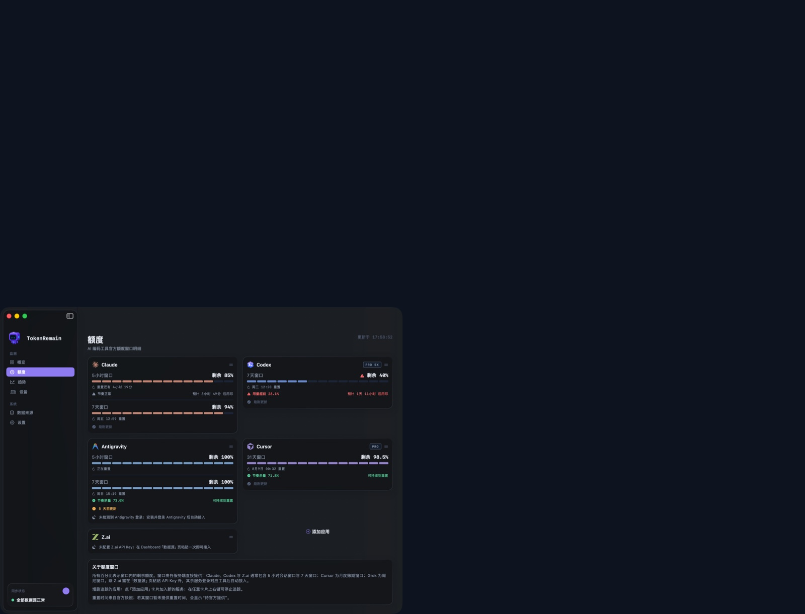<br/>
      <sub><b>Dashboard · 额度窗口与节奏预测</b></sub>
    </td>
    <td align="center" width="50%">
      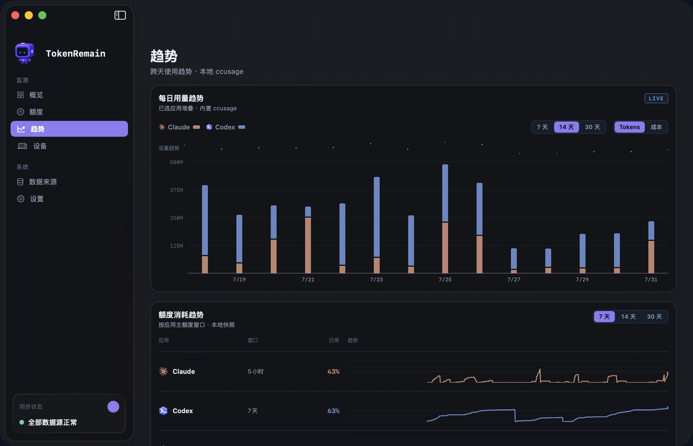<br/>
      <sub><b>Dashboard · 用量趋势</b></sub>
    </td>
  </tr>
</table>

<div align="center">
  <br/>
  <sub><b>菜单栏胶囊</b> — 自选常驻应用与剩余百分比</sub>
</div>

### iPhone · Apple Watch(加密同步伴侣)

<table>
  <tr>
    <td align="center" width="27%">
      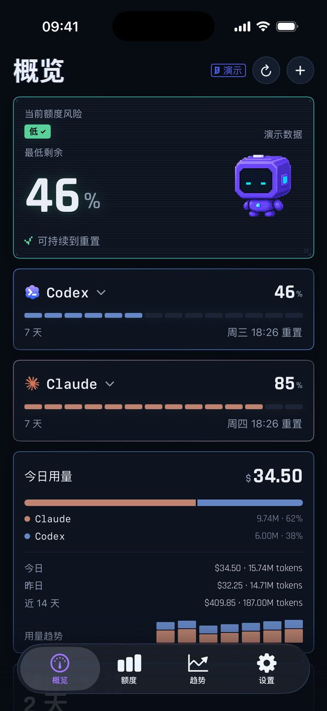<br/>
      <sub><b>概览</b> — 聚合最多 16 台 Mac</sub>
    </td>
    <td align="center" width="27%">
      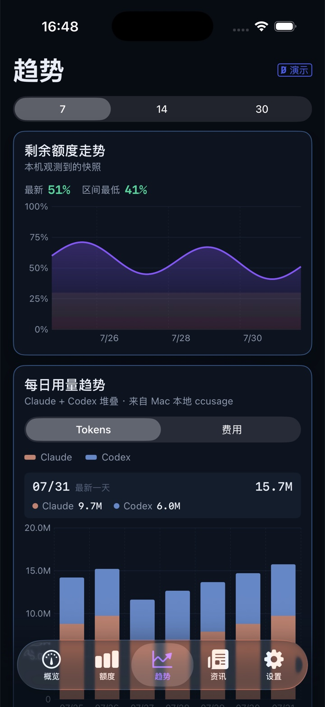<br/>
      <sub><b>趋势</b></sub>
    </td>
    <td align="center" width="27%">
      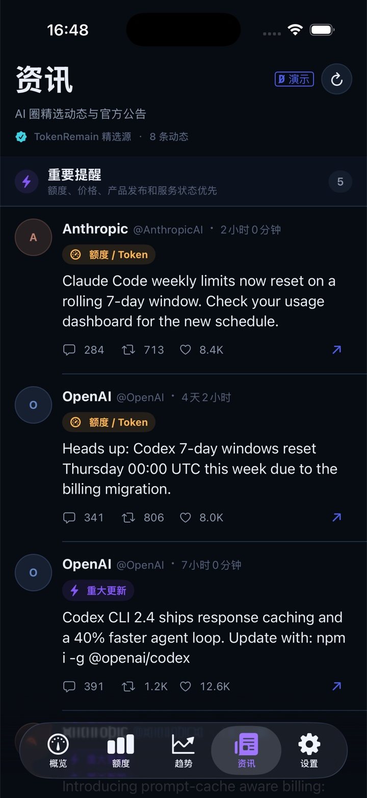<br/>
      <sub><b>AI Feed</b></sub>
    </td>
    <td align="center" width="19%">
      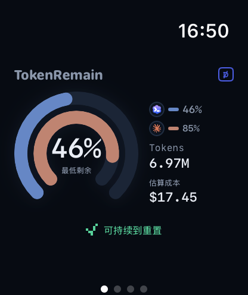<br/>
      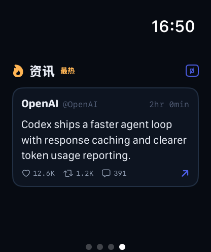<br/>
      <sub><b>Apple Watch</b></sub>
    </td>
  </tr>
</table>

<table>
  <tr>
    <td align="center" width="34%">
      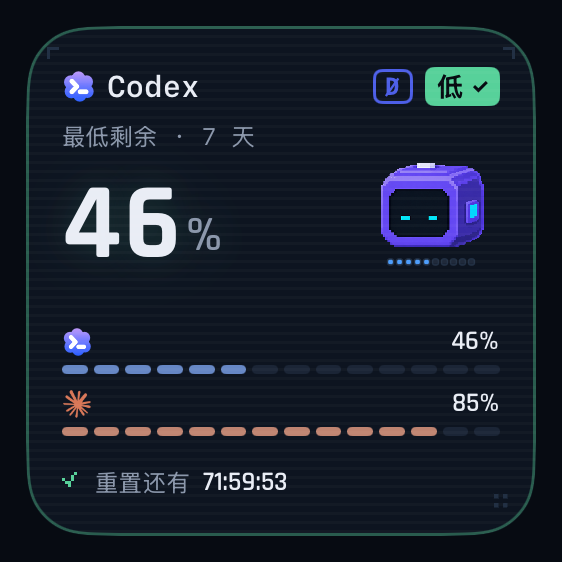<br/>
      <sub><b>小号小组件</b></sub>
    </td>
    <td align="center" width="66%">
      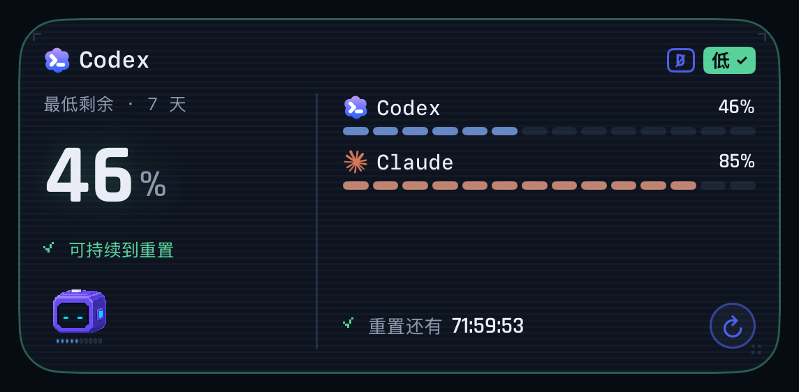<br/>
      <sub><b>中号小组件</b> — 最紧张的窗口直接放上主屏</sub>
    </td>
  </tr>
</table>

> 数据始终由 Mac 单向加密发布;移动客户端独立维护,源码不在本仓库开源范围内。

## 🔌 支持接入的应用

大多数服务**登录即自动接入**:只读取本机已有凭证,无需在 TokenRemain 内再次登录。Claude/Codex 使用官方桌面 App 即可,无需另装 CLI。

### 原生 Provider(11 家)

| 应用 | 接入方式 | 说明 |
| :-- | :-- | :-- |
|  **Claude Code** | 🟢 自动 | 5 小时 / 7 天窗口;第三方 `ANTHROPIC_BASE_URL` 标注实际 API |
|  **Codex** | 🟢 自动 | 5 小时 / 7 天窗口;自定义 `base_url` 标注实际 API |
|  **Cursor** | 🟢 自动 | 月度账期额度与重置倒计时 |
|  **Grok**(xAI)| 🟢 自动 | 周池剩余额度 |
|  **GitHub Copilot** | 🟢 自动 | 月度 Credits |
|  **Devin** | 🟢 自动 | 日 / 周配额 |
|  **Windsurf** | 🟢 自动 | 日 / 周配额 |
|  **Antigravity** | 🟢 自动 | 配额池 |
|  **OpenCode** | 🟢 自动 | 套餐本地估算;第三方 provider 标注实际 API |
|  **Z.ai**(GLM Coding Plan)| 🔑 API Key | 会话 / 周窗口与 MCP 月额度 |
|  **OpenRouter** | 🔑 API Key | Key 限额、Credits 与账户余额 |

> 🟢 **自动** = 登录对应工具即接入 · 🔑 **API Key** = 粘贴一次密钥,仅存 macOS 钥匙串

### token-monitor 兼容层(10 家)

| 应用 | 接入方式 | | 应用 | 接入方式 |
| :-- | :-- | :-- | :-- | :-- |
|  **DeepSeek** | API Key | |  **Qoder** | Cookie |
|  **Kimi** | API Key / Cookie | |  **Kiro** | `kiro-cli /usage` 解析 |
|  **MiniMax** | API Key | |  **火山引擎** | AK:SK 签名 |
|  **MiMo Code** | Cookie | |  **Ollama** | session Cookie |
|  **GLM Team** | API Key + Org + Project | | **第三方 API** | New API / 自定义余额接口 |

### 本地 Token / 成本来源

内置 ccusage 动态发现 Claude Code、Codex、Gemini、Goose 等 15+ 种本地 Agent,可在「数据来源」页逐项纳入或排除;Trae 只读取所选目录中的时间、模型与 token 计数。托管模型按官方标价估算,Ollama 等本地模型记零成本。

## 🔒 数据与隐私

> 隐私不是一句承诺,而是架构本身 —— 每一条都能在源码里核对。

```
你机器上已有的凭证 ──只读──▶ 各服务商官方 API ──▶ 本地渲染并缓存
```

- **只读凭证,绝不刷新** — 只读各工具自己维护的 token,从不写回,不与工具争用 refresh token;后台读取绝不弹系统授权窗。
- **手动密钥进钥匙串** — 手动粘贴的 API Key 仅存 macOS 钥匙串,绝不写入源码、构建产物或日志。
- **无账号、无遥测、无凭证中转** — 额度查询直连官方 API;官网只保留匿名下载总数的每日聚合快照。
- **价格更新不上传用量** — 每天至多一次拉取公开的 LiteLLM 价格表,请求不携带任何本机数据。
- **缓存与统计留在本地** — 仅开启同步后,一份加密展示快照才进入你自己的 iCloud 私有库。

细节见[隐私政策](https://tokenremain.com/privacy)。成本为 API 标价估算,不等于订阅账单。

## 📡 AI Feed

`broadcast/`(Cloudflare Workers + D1 + Queues)分两梯队精选 X 官方账号的原帖与引用帖,公开提供 `GET /v1/ai-feed`,并按设备时区每天推送一次 APNs 摘要。设备注册只用随机安装 ID,X / APNs 密钥只存于 Worker Secret。完整契约见 [`docs/curated-feed-contract.md`](docs/curated-feed-contract.md) 与 [`broadcast/README.md`](broadcast/README.md)。

## 🚀 本地运行

```bash
bash ./script/build_and_run.sh --verify
```

构建后安装到 `~/Applications/UsageDock.app`。本公开仓库只包含 macOS Desktop 客户端及其服务、网站与发布支持;移动客户端源码独立维护。

| 目录 | 内容 |
| :-- | :-- |
| `Sources/UsageDock/` · `Package.swift` | SwiftPM 菜单栏 App |
| `Packages/TokenRemainSyncKit/` | 最小加密同步协议包 |
| `broadcast/` | Cloudflare Workers 后端(AI Feed + 下载计数) |
| `site/` | 官网、隐私政策与支持页 |
| `docs/` | 发布、隐私与架构文档 |
| `design/` | 品牌、色板与 UI 源 |
| `script/` | 构建、打包与校验脚本 |

## 📈 下载趋势

<div align="center">

<picture>
  <source media="(prefers-color-scheme: dark)" srcset="https://api.tokenremain.com/v1/downloads/chart.svg?theme=dark&amp;lang=zh" />
  <source media="(prefers-color-scheme: light)" srcset="https://api.tokenremain.com/v1/downloads/chart.svg?theme=light&amp;lang=zh" />
  
</picture>

<sub>起始基线为 `TokenRemain.dmg` 历史累计 163 次(截至 2026-08-07,[明细](docs/download-baseline.md)),此后由官网匿名计数器逐日累计;不含任何个人数据。</sub>

</div>

## 📄 开源许可

源代码与源文档采用 [Apache License 2.0](LICENSE);TokenRemain 名称、Logo、图标、机器人形象与原创设计素材不在授权范围内,详见[品牌与素材许可说明](ASSET-LICENSE.md)。

---

<div align="center">
<sub>

TokenRemain 是独立应用,与 Anthropic、OpenAI、Anysphere、xAI、GitHub、智谱 AI 或任何服务商均无隶属、背书或赞助关系;服务名称与标识仅用于标示你可选择接入的服务。

发布者与支持联系人:Dongheng Li · jamescarstin520@gmail.com · © 2026

</sub>
</div>
