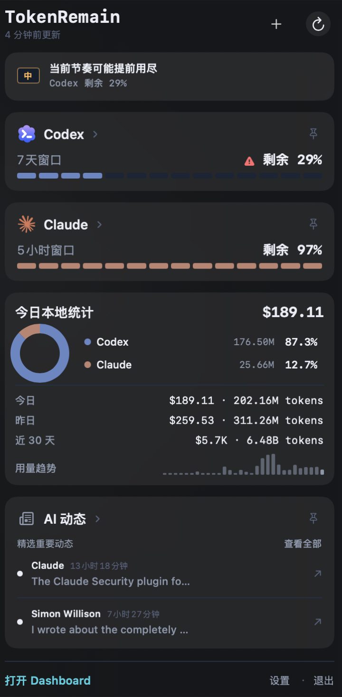
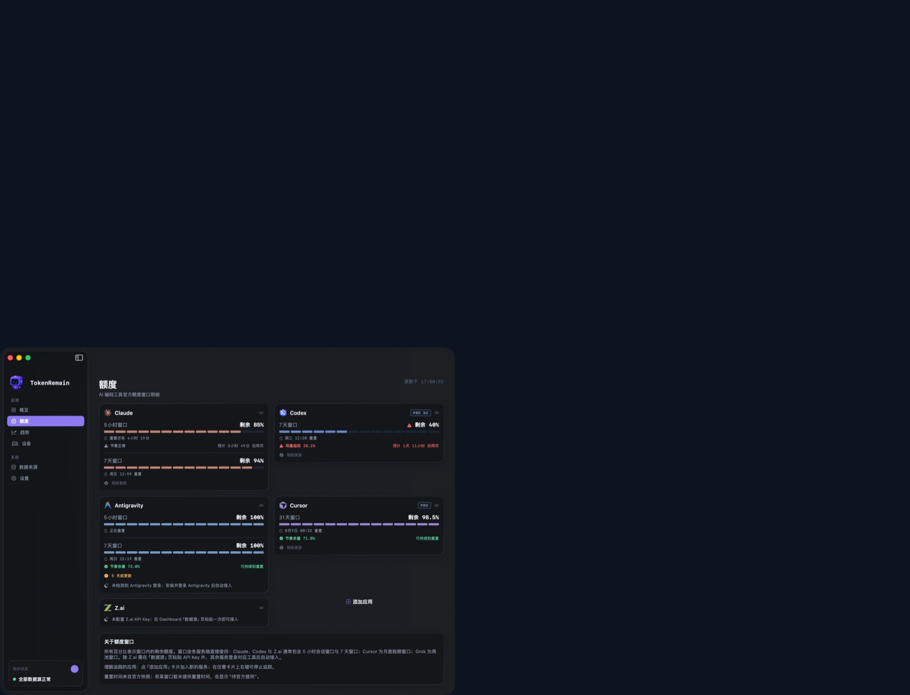
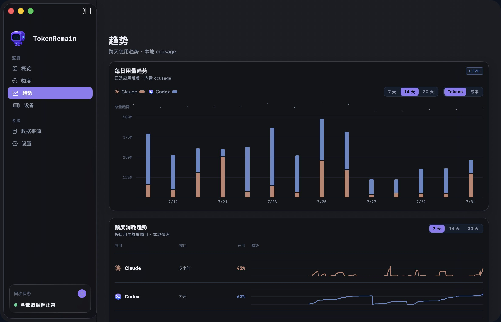
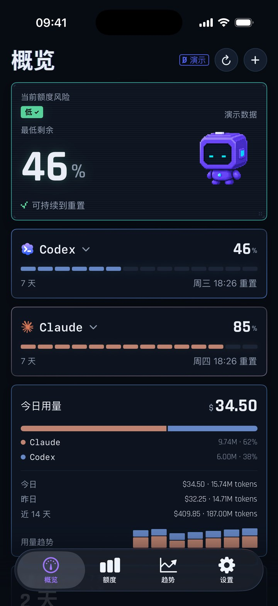
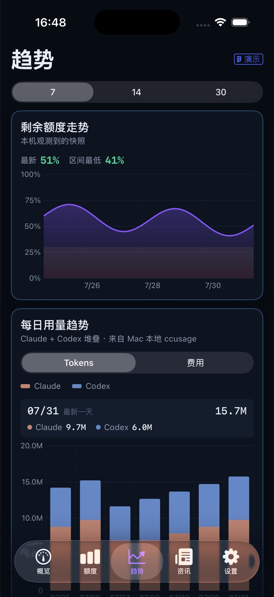
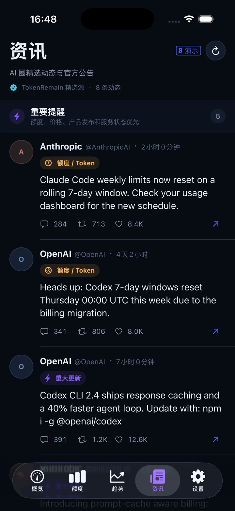
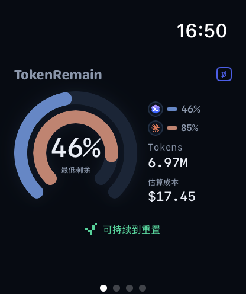
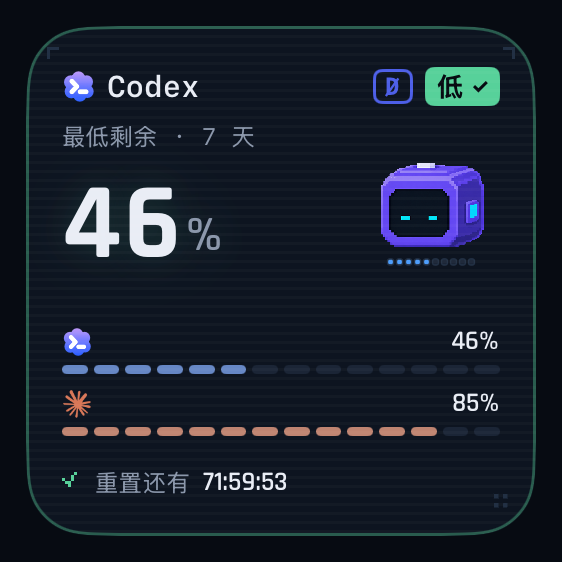
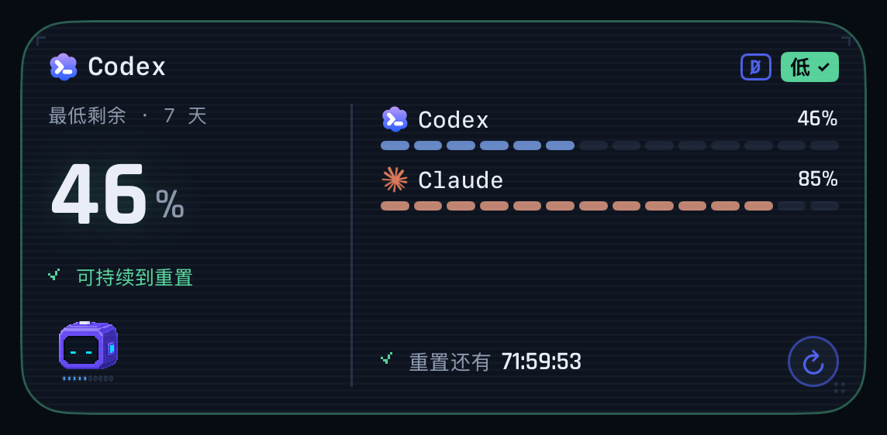
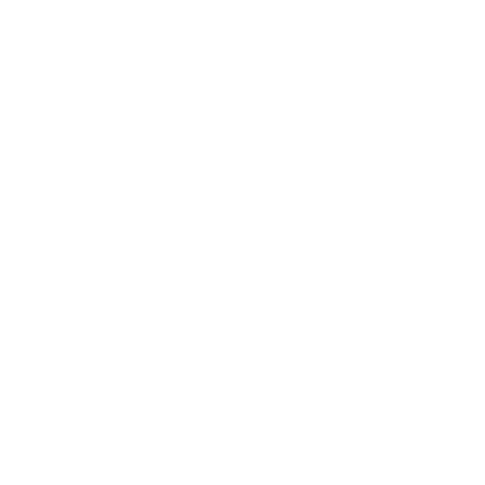

<div align="center">

<a href="https://tokenremain.com"></a>

# TokenRemain

</div>

<h4 align="center">
  <a href="https://tokenremain.com">官网</a> |
  <a href="https://testflight.apple.com/join/DU3DrnhG">iPhone 测试版</a> |
  <a href="https://tokenremain.com/privacy">隐私政策</a> |
  <a href="CHANGELOG.md">更新记录</a> |
  <a href="https://github.com/Carstin520/token-remain/issues">问题反馈</a> |
  <a href="README.en.md">English</a>
</h4>

<div align="center">
  <h3>
    AI 编码工具的剩余额度,常驻在 Mac 菜单栏。<br/>
    凭证只留在本机:只读、不刷新、不上传。
  </h3>
</div>

<p align="center">
  <a href="https://github.com/Carstin520/token-remain/releases/latest"></a>
  
  
  <a href="LICENSE"></a>
</p>

<h3 align="center">
  <a href="https://api.tokenremain.com/v1/downloads/macos">⬇️ 下载 TokenRemain.dmg</a>
</h3>

<p align="center">
  
  
</p>
<p align="center"><sub>Claude Code、Codex、Cursor、Grok、GLM 等 21+ 家工具的剩余额度、重置倒计时与今日成本,一屏看完。</sub></p>

## 功能

- 🧭&nbsp;21+ 家 AI 编码工具的额度窗口并排展示,带重置倒计时。
- ⏱️&nbsp;节奏预测:按真实窗口进度判断能否撑到重置,撑不到时给出预计可用时长。
- 💰&nbsp;今日成本:本地统计 15+ 种编码 Agent 的 token,按官方 API 标价估算。
- 🔐&nbsp;只读本机已有凭证 —— 无账号、无遥测、不刷新、不上传。
- 📱&nbsp;可选加密同步到 iPhone、Apple Watch 与桌面小组件。
- 📡&nbsp;AI Feed:精选 Anthropic、OpenAI 等官方账号动态,重大更新本机通知。
- ⚡&nbsp;低能耗:后台 CPU 比 v1.2.2 降低 95%([测试方法](docs/performance-v1.2.3.md))。
- 🎨&nbsp;macOS 26 Liquid Glass;菜单栏胶囊、跨空间浮窗。
- 🌐&nbsp;多语言界面:简体中文、繁体中文、English、日本語、한국어 等。

<details>
<summary><b>更多截图</b>(额度页、趋势页、iPhone 与 Apple Watch)</summary>
<br/>

<p align="center">
  
  
</p>
<p align="center">
  
  
  
  
</p>
<p align="center">
  
  
</p>

iPhone 版目前为 [TestFlight 公开测试](https://testflight.apple.com/join/DU3DrnhG);数据由 Mac 单向加密发布,移动客户端源码不在本仓库开源范围内。

</details>

## 快速上手

1. [下载 DMG](https://api.tokenremain.com/v1/downloads/macos),把 TokenRemain 拖进「应用程序」后打开。
2. 欢迎页会扫描本机已安装的 AI 工具,勾选要追踪的即可。凭证沿用各工具自己的登录,无需在 TokenRemain 里再登录;Claude/Codex 用官方桌面 App 即可,无需另装 CLI。
3. Z.ai、OpenRouter 等需要 API Key 的服务:直接在对应额度卡里粘贴,或在「数据来源」页的「API Key 设置」中填写。密钥只存本机钥匙串。
4. 在「设置 › 刷新与同步」调整额度刷新频率(1–30 分钟或仅手动);在「数据来源」页选择纳入成本统计的本地 Agent。

## 支持接入的应用

🟢 **自动** = 登录对应工具即接入 · 🔑 **API Key** = 粘贴一次密钥,仅存 macOS 钥匙串

| 应用 | 接入 | 读取内容 |
| :-- | :-- | :-- |
|  **Claude Code** | 🟢 | 5 小时 / 7 天窗口;第三方 `ANTHROPIC_BASE_URL` 标注实际 API |
|  **Codex** | 🟢 | 5 小时 / 7 天窗口;自定义 `base_url` 标注实际 API |
|  **Cursor** | 🟢 | 月度账期额度与重置倒计时 |
|  **Grok**(xAI)| 🟢 | 周池剩余额度 |
|  **GitHub Copilot** | 🟢 | 月度 Credits |
|  **Devin** | 🟢 | 日 / 周配额 |
|  **Windsurf** | 🟢 | 日 / 周配额 |
|  **Antigravity** | 🟢 | 配额池 |
|  **OpenCode** | 🟢 | 套餐本地估算;第三方 provider 标注实际 API |
|  **Z.ai**(GLM Coding Plan)| 🔑 | 会话 / 周窗口与 MCP 月额度 |
|  **OpenRouter** | 🔑 | Key 限额、Credits 与账户余额 |

<details>
<summary><b>另外 11 家扩展 Provider</b>与本地成本来源</summary>
<br/>

| 应用 | 接入方式 | | 应用 | 接入方式 |
| :-- | :-- | :-- | :-- | :-- |
|  **DeepSeek** | API Key | |  **Qoder** | Cookie |
|  **Kimi** | API Key / Cookie | |  **Kiro** | `kiro-cli /usage` 解析 |
|  **MiniMax** | API Key | |  **火山引擎** | AK:SK 签名 |
|  **MiMo Code** | Cookie | |  **Ollama** | session Cookie |
|  **GLM Team** | API Key + Org + Project | | **第三方 API** | New API / 自定义余额接口 |
|  **阿里云百炼 Token Plan** | 控制台 Cookie | | | |

**Cookie 型服务怎么接入**:在浏览器登录对应网站后,从开发者工具复制请求里的 Cookie,粘贴到该服务的额度卡即可(也可用 `QODER_COOKIE`、`MIMO_COOKIE`、`OLLAMA_COOKIE` 环境变量提供)。Cookie 与 API Key 一样只存本机钥匙串;TokenRemain 从不读取浏览器自身的 Cookie 存储。Cookie 等同于登录凭证,请勿分享;退出网站登录后它会失效,需要重新粘贴。

**本地成本来源**:内置 ccusage 动态发现 Claude Code、Codex、Gemini、Goose 等 15+ 种本地 Agent;Trae 只读取所选目录中的时间、模型与 token 计数。托管模型按官方标价估算,Ollama 等本地模型记零成本。

</details>

## 隐私

```
你机器上已有的凭证 ──只读──▶ 各服务商官方 API ──▶ 本地渲染并缓存
```

每一条都附有可核对的源码或测试:

- **只读凭证,绝不刷新** — 只读各工具自己维护的 token,从不写回、不争用 refresh token;后台读取关闭钥匙串交互,不会弹出授权窗。 <sub>🔍 [契约脚本](script/verify_keychain_read_contract.sh) · [测试](Tests/UsageDockTests/KeychainReadTests.swift#L45) · [源码](Sources/UsageDock/Services/ClaudeOAuthUsageService.swift#L9)</sub>
- **手动密钥只进本机钥匙串** — 粘贴的 API Key 存入 macOS 钥匙串,且禁止同步到 iCloud 钥匙串。 <sub>🔍 [源码](Sources/UsageDock/Services/KeychainSecretStore.swift#L176) · [测试](Tests/UsageDockTests/AppOwnedKeychainTests.swift#L15)</sub>
- **无账号、无遥测、无凭证中转** — 额度查询直连各服务商官方 API;依赖只有 Sparkle 与本仓库的同步包,没有任何分析 SDK。 <sub>🔍 [依赖清单](Package.swift)</sub>
- **价格更新不带任何本机数据** — 每天至多一次无 body、无参数、无认证头的 GET,拉取公开的 LiteLLM 价格表。 <sub>🔍 [测试](Tests/UsageDockTests/CCUsagePricingServiceTests.swift#L19) · [契约脚本](script/verify_bundled_ccusage_contract.sh#L42)</sub>
- **同步默认关闭,端到端加密** — 开启后,只有白名单字段组成的展示快照在本机 AES-GCM 加密,再写入你自己的 iCloud 私有库。 <sub>🔍 [默认关闭测试](Tests/UsageDockTests/CrossDeviceSyncDefaultsTests.swift#L8) · [字段白名单](Sources/UsageDock/Sync/MobileSnapshotRedactor.swift#L7) · [加密实现](Packages/TokenRemainSyncKit/Sources/TokenRemainSyncKit/EncryptedSyncEnvelope.swift#L66)</sub>

**其他联网行为**(均不携带凭证或用量):AI Feed 从 `api.tokenremain.com` 拉取公开动态,通知默认关闭,开启后才用随机安装 ID 注册推送;服务状态读取 `status.openai.com`、`status.claude.com` 的公开接口;更新检查读取 GitHub 上签名的 appcast;局域网直连同步监听 TCP 47831,只接受已配对设备。

细节见[隐私政策](https://tokenremain.com/privacy)。

## 常见问题

<details>
<summary><b>卡片提示「未检测到登录」</b></summary>
<br/>

TokenRemain 从不刷新 token,只读取工具自己保存的登录状态。到对应工具里重新登录并正常使用一次,数据会自动恢复;Antigravity 等工具需要先打开使用一次,凭证才会写到本机。

</details>

<details>
<summary><b>Claude 显示「用量读取超时」或「无法连接 Claude 服务」</b></summary>
<br/>

此时卡片显示的是最近一次成功的缓存,网络恢复后自动重试,不会要求你重新登录。官方 API 走系统代理;凭证过期需要借助 Claude Code CLI 续期时,TokenRemain 会依次尝试 App 环境变量、Claude Code `settings.json` 的 `env`、系统代理(含 PAC)和登录 shell 导出的代理变量,选第一条能连通 `api.anthropic.com` 的。仍无法恢复时,可在终端运行一次 `claude` 并执行 `/usage`。

</details>

<details>
<summary><b>顶部预警和卡片上的百分比不一致</b></summary>
<br/>

预警取所有窗口中最紧缺的一个(通常是 7 天窗口),卡片头行显示的是 5 小时窗口,两者不是同一个窗口。

</details>

<details>
<summary><b>今日成本和我的账单对不上</b></summary>
<br/>

成本按官方 API 标价估算本地 token 用量,用于衡量用量规模,不等于订阅账单。

</details>

<details>
<summary><b>卡片标注了「第三方 API」</b></summary>
<br/>

Claude Code 设置了 `ANTHROPIC_BASE_URL`,或 Codex 配置了自定义 `base_url` 时,额度来自实际提供服务的 API,卡片会注明来源。如果你用的是官方登录却被这样标注,请[提交 issue](https://github.com/Carstin520/token-remain/issues) 并附上脱敏后的配置。

</details>

<details>
<summary><b>如何彻底卸载</b></summary>
<br/>

退出 TokenRemain 并删除 App 后,可清理本地偏好与缓存:

```bash
defaults delete com.jamesli.usagedock
rm -rf ~/Library/Caches/com.jamesli.usagedock ~/Library/Application\ Support/com.jamesli.usagedock
```

手动粘贴的密钥可在「钥匙串访问」中搜索 `com.jamesli.usagedock` 删除。开启过同步的话,如需清除 iCloud 中的数据,请[联系支持](https://tokenremain.com/support)。

</details>

还有问题?请[提交 issue](https://github.com/Carstin520/token-remain/issues) 或查看[支持页](https://tokenremain.com/support)。

## 参与开发

欢迎提交 issue 与 PR。构建、测试、目录结构与代码约定见 [CONTRIBUTING.md](CONTRIBUTING.md);安全问题请按 [SECURITY.md](SECURITY.md) 私下报告,不要公开提交 issue。

## 下载趋势

<div align="center">

<picture>
  <source media="(prefers-color-scheme: dark)" srcset="https://api.tokenremain.com/v1/downloads/chart.svg?theme=dark&amp;lang=zh" />
  <source media="(prefers-color-scheme: light)" srcset="https://api.tokenremain.com/v1/downloads/chart.svg?theme=light&amp;lang=zh" />
  
</picture>

<sub>基线为截至 2026-08-07 的 163 次历史下载([明细](docs/download-baseline.md)),此后由匿名计数器逐日累计,不含任何个人数据。</sub>

</div>

## 致谢

- [token-monitor](https://github.com/Javis603/token-monitor)(MIT)— 扩展 Provider 的额度读取逻辑移植自此项目,桌面浮窗与偏好设计也受其启发。
- [ccusage](https://github.com/ryoppippi/ccusage)(MIT)— 随 App 内置,用于统计本地 Agent 的 token 用量。
- [OpenUsage](https://github.com/robinebers/openusage)(MIT)— Claude 限额 API 直查的 provider 设计参考。
- [LiteLLM](https://github.com/BerriAI/litellm) — 公开的模型价格表。
- [Sparkle](https://github.com/sparkle-project/Sparkle)(MIT)— 签名自动更新。

第三方版权与许可声明见 [NOTICE](NOTICE)。

## 许可

源代码与源文档采用 [Apache License 2.0](LICENSE);TokenRemain 名称、Logo、图标、机器人形象与原创设计素材不在授权范围内,详见[品牌与素材许可说明](ASSET-LICENSE.md)。

<sub>TokenRemain 是独立应用,与 Anthropic、OpenAI、Anysphere、xAI、GitHub、智谱 AI 或任何服务商均无隶属、背书或赞助关系;服务名称与标识仅用于标示你可选择接入的服务。发布者与支持联系人:Dongheng Li · jamescarstin520@gmail.com · © 2026</sub>
