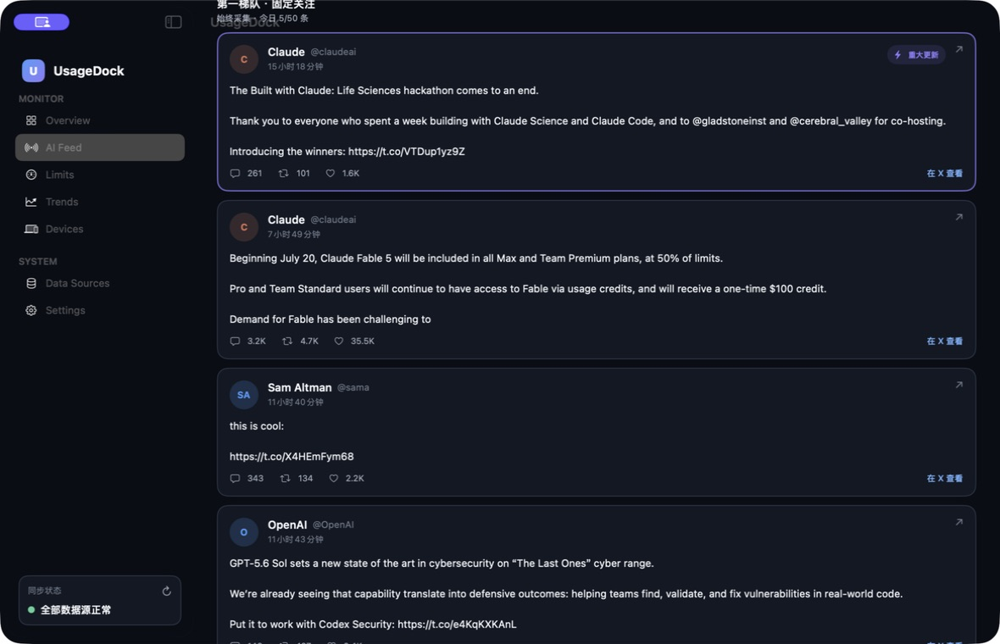
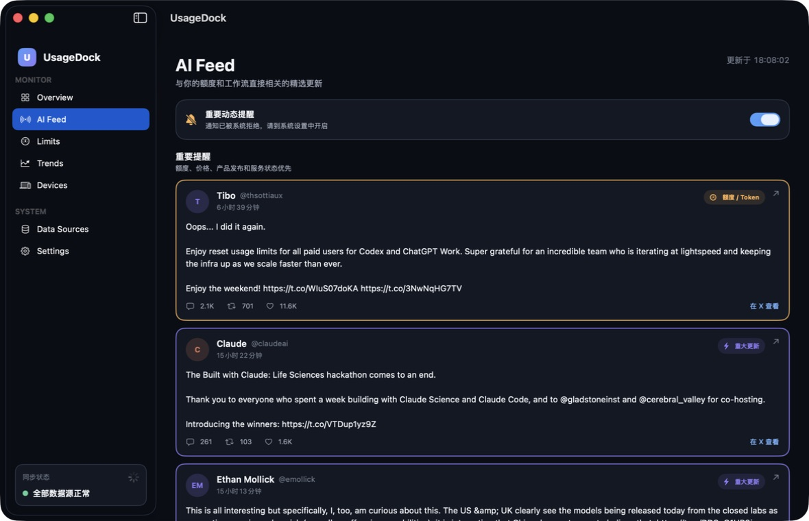

# AI Feed product-surface review

## Scope

Review and implement the AI Feed as a passive, curated product experience. Internal source tiers, monitored accounts, selection mechanics, and X API configuration must not be visible to users.

## Step 1 — Before

Health: needs restructuring.

- The page exposed internal collection tiers, account handles, daily caps, heat selection, and X API controls.
- Primary and rotating sections determined presentation order, so internal infrastructure leaked into the user experience.
- Rotating selection used aggregate engagement by account, allowing unrelated high-engagement posts to crowd out useful low-engagement updates.
- The screenshot's Tibo account was `@thsottiaux`, but the collector monitored `@btibor91`; the reset post never entered the candidate set.

## Step 2 — After

Health: verified.

- The page is now a single curated feed with user-facing groups: “重要提醒” and “更多值得关注”.
- Account lists, collection tiers, heat-selection details, and API configuration are absent.
- `@thsottiaux` is monitored in the always-on backend source set.
- The real reset post was fetched, classified as a token reset, and rendered first.
- Rotating discovery now requires topic relevance for ordinary posts. Critical posts bypass account-popularity selection.
- Recommendation ranking combines direct user impact, AI-product relevance, freshness, source trust, and capped square-root engagement so raw follower scale cannot dominate.

## Accessibility and evidence limits

- The notification toggle has an explicit accessibility label, and post cards retain labels and “open on X” hints.
- The rebuilt screen was checked through the macOS accessibility tree and a rendered screenshot.
- Full keyboard traversal and VoiceOver speech output were not exercised in this pass.
