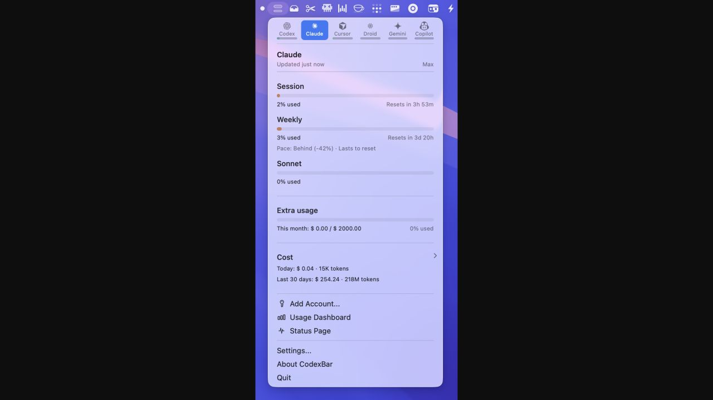
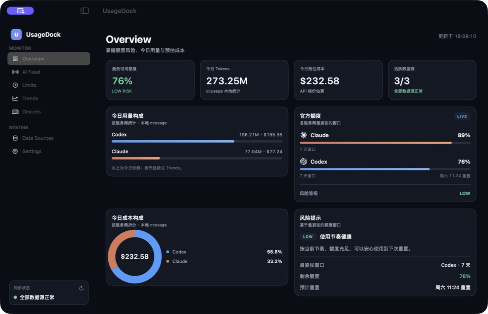
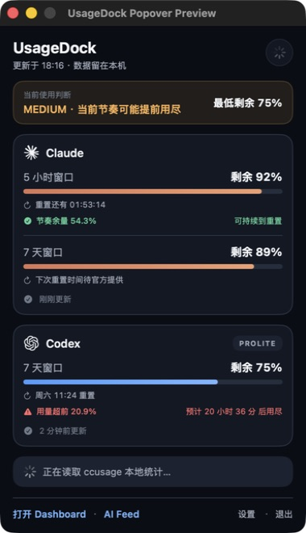
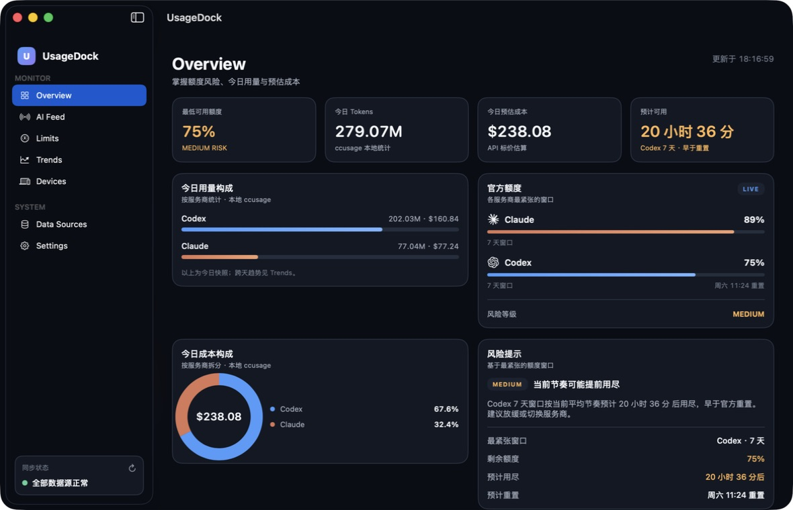

# CodexBar 对照与 UsageDock 优化审计

## 审计范围

- 对照对象：CodexBar 当前 GitHub 产品说明与官方菜单栏截图。
- 本地对象：UsageDock 的 Overview、菜单栏弹层、额度卡与刷新体验。
- 用户目标：打开应用后快速判断“还能不能继续跑任务、什么时候会用尽、数据是否可信”。

## CodexBar 的产品优势

1. **决策入口足够短。** 菜单栏直接显示多服务商额度，弹层把窗口、重置倒计时、成本和状态放在同一条操作路径上。
2. **从静态额度升级到使用节奏。** Pace 会比较窗口进度和实际消耗，并回答“能否撑到重置”或“预计多久用尽”。
3. **数据可信度可见。** 手动刷新、过期/错误状态和服务商事故提示都留在当前界面，不让旧数据伪装成实时结果。
4. **多服务商扩展成熟。** Provider 驱动的共享 UI、合并图标、切换器、CLI、Widget 和多语言形成了完整生态。
5. **隐私边界写得清楚。** 默认本机解析，按数据源复用已有会话；额外 Cookie、Keychain 或 API Key 能力有明确开关与说明。

## 对 UsageDock 的判断

UsageDock 已经拥有 CodexBar 没有强调的优势：完整 Dashboard、Claude/Codex 今日成本拆分、AI Feed，以及更收敛的 Claude CLI 授权路径。真正的缺口不是“更多页面”，而是旧版风险只看剩余百分比：即使短时间内快速消耗，仍可能显示 `LOW / 使用节奏健康`。另外，额度卡只有绝对更新时间，用户无法一眼判断数据是否陈旧。

## 本轮实施

1. 新增当前窗口节奏预测：只使用官方窗口长度、真实重置时间和当前已用比例；窗口开始不足 3% 时不输出预测，避免重置后的噪声。
2. 额度卡新增“节奏余量 / 用量超前”和“可持续到重置 / 预计多久后用尽”。
3. 当预测会早于重置耗尽时，整体风险至少提升为 `MEDIUM`，Overview 第四个 KPI 改为“预计可用”。
4. 额度卡显示“刚刚更新 / N 分钟前更新”，超过 10 分钟明确使用警告图标和颜色。
5. 每次打开菜单栏弹层会触发一次非阻塞轻量刷新；现有刷新按钮仍保留强制刷新能力。
6. 菜单栏提示文字加入当前使用判断，Dashboard 风险区给出具体服务商、窗口、预计用尽时间和行动建议。

## 流程证据

### Step 1 — CodexBar 菜单弹层：健康

优势是单屏决策密度高；风险是服务商和设置能力继续扩张后，弹层容易变得过长。截图无法验证键盘导航、VoiceOver 顺序和动态刷新行为。

### Step 2 — UsageDock 优化前 Overview：部分健康

成本、额度和风险分区清楚，但 `LOW / 使用节奏健康` 只由剩余百分比得出，没有回答当前速度是否会提前耗尽。“活跃数据源 3/3”与左下同步状态重复，占用了最重要的 KPI 位。

### Step 3 — UsageDock 优化后菜单弹层：健康

当前真实数据下，Claude 5 小时窗口显示节奏余量并确认可持续到重置；Codex 7 天窗口显示用量超前和预计用尽时间。风险信息同时用 `MEDIUM`、文字和颜色表达，不依赖颜色单独传意。

### Step 4 — UsageDock 优化后 Overview：健康

第四个 KPI 现在直接回答“预计可用 20 小时 36 分”，风险面板解释这是 Codex 7 天窗口按当前平均节奏得到的估计，并给出放缓或切换服务商的建议。

## 可访问性与证据边界

- 当前运行态的辅助功能树能读出风险等级、最低剩余、预计可用时间、刷新按钮标签和额度卡内容。
- 风险和新鲜度均有文字标签，不仅依赖色彩。
- 本轮没有完成 VoiceOver 全流程、键盘焦点顺序、提高对比度模式和缩放后的重排测试，因此不能据此声明完整无障碍合规。
