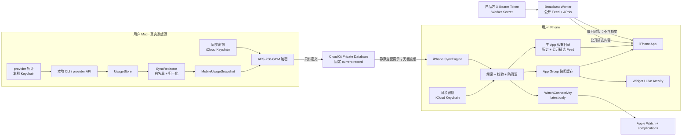

# TokenRemain 跨设备数据与隐私架构

状态：已实现，并通过本地、模拟器和真机 CloudKit 端到端验证
日期：2026-07-22
范围：macOS → iPhone → Widget / Live Activity → Apple Watch

## 1. 结论

生产版采用“Mac 是数据源，iPhone 是只读镜像，Watch 是 iPhone 的只读镜像”的单向同步模型：

1. Mac 继续在本地读取各工具额度；首发同步只发布显式 `SyncedProviderID` 白名单中的稳定 Provider ID、额度窗口、采集时间和状态。
2. Mac 先执行严格的数据白名单和脱敏，再生成独立的移动端快照。
3. 快照使用应用层 AES-256-GCM 加密，密钥只保存在用户的 iCloud 钥匙串中。
4. 密文写入用户自己的 CloudKit Private Database；不建设可读取用户额度数据的 TokenRemain 业务服务器。
5. iPhone 收到 CloudKit 静默变更提示后拉取密文；当前额度更新 App Group、Widget 和 Live Activity，每日历史只保存在主 App 私有目录。公开 X Feed 走独立、无用户账户的广播服务，不进入额度快照。
6. iPhone 沿用现有 `WatchConnectivity.updateApplicationContext`，把最新快照发给 Apple Watch。

这条路径同时满足异地同步、低运维成本、Apple 账户免登录、服务端不可读和现有 Apple 端代码可渐进迁移。不同 Apple 账户之间的同步不进入首发范围。

## 2. 设计原则

- **用户凭证永不跨设备。** Claude / Codex access token、refresh token、API Key、Cookie、GitHub 登录态等只留在 Mac 本机。产品方唯一的 X Bearer Token 只保存在 Broadcast Worker Secret 中，从不进入 Apple 客户端。
- **首次安装自动连接，用户可随时退出。** Mac 和 iPhone 首次运行会自动自检并加入同一 Apple 账户下的私有同步；显式关闭后保持关闭。两端均显示同步状态、最近检查时间和删除入口。
- **默认只同步最少结果。** 只同步用于展示的稳定 provider ID、额度百分比、
  窗口时长、重置时间、采集时间、受控状态和经过净化的套餐标签。
- **单向、单写者。** Mac 是额度快照唯一写者；iPhone、Widget、Watch 不回写额度，消除绝大多数冲突。
- **业务服务器不碰用户额度。** Broadcast Worker 只处理产品方公开 X 帖子、匿名 APNs 设备注册和投递状态；用户额度继续只走应用层加密的 CloudKit Private Database。
- **推送只作提示。** APNs / CloudKit notification 不携带百分比、费用或 provider 明细。
- **失败时诚实降级。** 无 iCloud、密钥未到达、快照过期、解密失败都显示明确状态，不回退到演示数字。
- **用户可看、可导出、可删除。** 设置页提供“本次会同步什么”、导出、断开、删除云端副本。

## 3. 当前工程事实与缺口

当前实现已经具备：

- macOS 的真实额度来源集中在 `UsageStore`，并由显式
  `MobileSnapshotRedactor` 只挑选当前 `SyncedProviderID` 白名单中的稳定
  provider ID、额度窗口、采集时间、受控状态和经过净化的套餐标签。每日
  Token / 费用历史仍只允许 Claude / Codex 的按日聚合值。
- iPhone / Widget 共享 `SnapshotStore` 和 `UsageSnapshot`；真实来源为 `.macSync`，首次启动仍为 `.none`。
- iPhone → Watch 已使用 `WatchConnectivity.updateApplicationContext`，符合“最新值覆盖”的需求。
- CloudKit Private Database、AES-256-GCM envelope、同步 Keychain、重放防护和静默通知入口均已接入。
- 独立 Broadcast Worker、D1 公开 Feed、匿名设备注册、按时区每日摘要和 Apple 客户端直连路径已实现；Cloudflare、X 与 APNs 生产凭证均已配置。macOS Developer ID 正式包已经携带 Production APNs entitlement 并通过 Apple 公证。

发布前仍必须解决：

1. macOS bundle id 是 `com.jamesli.usagedock`，iPhone 是 `com.jamesli.tokenremain`；两者需要同一 Apple Developer Team、同一个 CloudKit container 和共享 Keychain Access Group。
2. macOS 目前由 SwiftPM 脚本手工打包开发签名，没有 iCloud / CloudKit entitlements。官网直装版可以继续使用 CloudKit，但生产包必须改为 Developer ID Application 签名，内含支持 CloudKit 的 Developer ID provisioning profile，并通过 Hardened Runtime、notarization 和 stapling。
3. 在真机完成 Mac → CloudKit → iPhone → Widget / Watch 的真实账户验证和删除验证。
4. 将 CloudKit Development schema 部署到 Production，并验证发布签名、notarization 与最终 entitlements。
5. 隐私政策、商店声明和发布文案必须与真实同步行为一致。

## 4. 数据流和信任边界



关键边界：

- `UsageStore → SyncRedactor` 是最重要的隐私边界。只有明确列入 allowlist 的字段可离开 Mac。
- CloudKit 记录只包含加密 envelope。TokenRemain 自建服务不参与上传、下载或密钥分发。
- iPhone 解密后仍只保存展示所需的快照；Watch 只收到 iPhone 已验证的同一份快照。
- 广播 Feed 与额度同步完全分离。CloudKit envelope 不再携带 Feed；Worker 不接收 provider 额度、CloudKit source ID、同步 key 或用户账户。

## 5. 同步数据白名单

### 5.1 默认允许跨设备

首发发布者只生成当前 `SyncedProviderID.supportedOnCurrentMobile` 明确列出的
provider 条目。该集合与 Mac 的 `ProviderQuota.Provider.displayOrder` 由测试锁定；
新增 provider 必须同时更新跨端白名单、范围校验和隐私审查，不能因为 Mac
模型中出现了新字段就自动进入快照。Claude / Codex 的特殊边界仅适用于下方
可选的每日 Token / 费用历史。

| 字段 | 用途 | 隐私处理 |
|---|---|---|
| `schemaVersion` | 兼容解码 | 明文含义低风险，仍放入密文 |
| `sourceInstanceID` | 区分 Mac 安装实例 | 随机 UUID，不用设备序列号或硬件 ID |
| `sequence` | 防止旧快照覆盖新快照 | 每个 source 单调递增 |
| `generatedAt` / `expiresAt` | 新鲜度和过期判断 | 不发送用户时区 |
| `providerID` | 显示 provider | 使用稳定产品枚举，不含账号名 |
| `usedPercent` | 计算剩余额度 | 限定到 `0...100` |
| `windowMinutes` | 窗口类型 | 正整数或 `0` 表示非周期池 |
| `resetsAt` | 倒计时 | 可空；不推断未知时间 |
| `capturedAt` | 数据新鲜度 | 可与 provider 原始采集时间不同 |
| `statusCode` | 离线 / 过期 / 正常 | 使用受控枚举，不传原始错误文本 |

旧协议中的 `curatedFeed` 字段仅为向后兼容而保留；当前 Mac 发布者固定写入 `nil`。iPhone 和 macOS 从广播服务直接读取公开帖子，iPhone 只在主 App 私有 Application Support 保存最多 3 条展示记录，不进入 App Group、Widget、Live Activity 或 Watch。

### 5.2 默认不跨设备

- access token、refresh token、session token、API Key、Cookie；产品方 X Bearer Token 也绝不进入 CloudKit 或客户端。
- 用户名、邮箱、provider account id、组织名、套餐的原始账号标识。
- prompt、聊天内容、项目名、仓库名、文件路径、终端命令、CLI 原始日志。
- HTTP request / response body、认证 header、provider 原始错误字符串。
- Mac 设备名称、序列号、硬件 UUID、IP 地址。
- X Bearer Token、互动统计、监控账号配置、AI Feed 已读记录和用户浏览行为。
- 完整的逐请求 token 消耗明细。

### 5.3 可选敏感项：每日用量历史

“每日 Token / 估算费用历史”是独立、默认关闭的同步授权。用户在 Mac 明确开启后：

- 只发送 Claude / Codex 的按日聚合 token 与估算费用，以及 `yyyy-MM-dd` 日期键和采集时间。
- 最多携带最近 30 天；按日期去重、升序排列，并拒绝未来日期、负数、非有限费用和超限载荷。
- 不发送会话级、项目级、模型级、prompt 级或逐请求数据。
- 历史与当前额度一起进入 AES-256-GCM envelope；CloudKit 仍只有可覆盖的固定 current record，不形成服务器端逐日记录库。
- iPhone 解密后把每日历史保存在主 App 私有 Application Support 目录并启用 Data Protection，不写 App Group，也不分发给 Widget、Live Activity 或 Watch。
- 用户关闭该独立授权后，Mac 下一份快照不再含历史；iPhone 收到后删除本地每日历史。断开同步也会清理本地副本。

## 6. 传输协议

### 6.1 业务快照

不要让 macOS 的 `ProviderQuota` 直接编码后上传。定义跨端专用 DTO，并让两端共同依赖：

```swift
struct MobileUsageSnapshot: Codable, Sendable, Equatable {
    let schemaVersion: Int
    let sourceInstanceID: UUID
    let sequence: UInt64
    let generatedAt: Date
    let expiresAt: Date
    let providers: [SyncedProviderQuota]
    let aggregateUsage: AggregateUsage? // 用户明确开启后才存在
}

struct SyncedProviderQuota: Codable, Sendable, Equatable {
    let providerID: String
    let windows: [SyncedQuotaWindow]
    let capturedAt: Date
    let statusCode: SyncedSourceStatus
}
```

解码规则：

- 未知顶层 schema：拒绝并保留上一份有效快照。
- 未知 provider：忽略该 provider，不使整个快照失败。
- 百分比越界、日期非法、窗口重复：拒绝该 provider。
- `expiresAt <= generatedAt`、快照超过最大未来偏差或签名认证失败：拒绝整份快照。
- UI 来源新增 `.macSync`；绝不把真实数据标成 `.demo`。

### 6.2 加密 envelope

```swift
struct EncryptedSyncEnvelope: Codable, Sendable {
    let envelopeVersion: Int
    let keyID: UUID
    let sourceInstanceID: UUID
    let sequence: UInt64
    let generatedAt: Date
    let sealedPayload: Data // AES.GCM.SealedBox.combined
}
```

- 算法：CryptoKit `AES.GCM`，256-bit 随机 key，每次加密随机 nonce。
- AAD：`envelopeVersion + keyID + sourceInstanceID + sequence + generatedAt + containerID`；必须按固定字段顺序和长度前缀编码，不能用存在歧义的字符串拼接。
- 序列化：稳定 JSON 或 CBOR；首发建议沿用 JSON，便于测试和导出，但日志永不打印正文。
- 大小限制：首发 envelope 控制在 32 KB 内；超出即失败，不做自动拆分。
- 可选抗流量分析：填充到固定的 4 KB 桶。首发可不做，但需要承认修改时间和大小仍是元数据。

### 6.3 CloudKit 记录

- Container：`iCloud.com.jamesli.tokenremain`。
- Database：private。
- Custom zone：`TokenRemainSync-v1`。
- Record type：`TRCurrentSnapshot`。
- Record name：固定 `current-v1`，每次覆盖，不形成默认云端历史。
- `encryptedValues["encryptedEnvelope"]`：应用层加密后的 `Data`。
- 仅保留协议版本等非敏感控制字段；provider、百分比、费用全部在 envelope 内。
- iPhone 建立 `CKRecordZoneSubscription`；通知只设置 `shouldSendContentAvailable`。
- 收到通知后必须重新 fetch 记录，不能把通知 payload 当作数据源。

CloudKit Private Database 只在用户登录 iCloud 时可用，数据归该用户，且 private database 内容不在开发者后台显示。CloudKit encrypted fields 在设备上加解密；应用层 envelope 进一步避免把隐私承诺依赖于用户是否开启 Advanced Data Protection。

## 7. 密钥设计

### 7.1 两类密钥必须分开

| 密钥 | 存储 | 是否跨设备 | 用途 |
|---|---|---|---|
| Provider credential | Mac Keychain，现有独立 service/account | **否** | Mac 调用 provider 或只读本地登录态 |
| Sync key | 共享 Keychain Access Group，`kSecAttrSynchronizable=true` | **是** | 加密/解密 `MobileUsageSnapshot` |

禁止把现有 `KeychainSecretStore` 直接改成全局 synchronizable。只新增专用 `SyncKeyStore`，避免 provider 凭证因一次属性变更而进入 iCloud Keychain。

### 7.2 Keychain 配置

- Shared access group：`$(AppIdentifierPrefix)com.jamesli.tokenremain.sync`。
- service：`com.jamesli.tokenremain.sync-key`。
- account：`key-v1-<keyID>`。
- 随机生成 32 bytes，不使用设备信息、用户密码或 CloudKit record id 派生。
- `kSecAttrSynchronizable = true`；禁止 `ThisDeviceOnly` 类别。
- 只有 iPhone 主 App 和 macOS App 需要读取同步 key；Widget / Watch 不需要访问这把 key。
- Widget 读取 iPhone 主 App 已验证后的 App Group 快照；Watch 读取 iPhone 经 WatchConnectivity 发来的快照。

### 7.3 生命周期

- 首次运行或重新开启同步：Mac 检查 iCloud / iCloud Keychain → 创建或读取 key → 上传第一份密文。
- 新 iPhone：同一 Apple 账户获取 key → fetch current record → 解密 → 显示 Mac 数据。
- 轮换：创建新 `keyID` → 用新 key 覆盖 current record → 确认至少一台手机成功读取 → 删除旧 key。首发可只提供“重置同步”，不做自动轮换。
- iPhone 本地断开：立即停止后台 pull，清除本地快照、真实历史、replay marker、Widget、Watch context 和 Live Activity。
- Mac 全局删除：删除 CloudKit zone 和同步 key；其他设备在下一次前台 pull 或有效 CloudKit 删除提示时清除本地副本。离线设备无法被任何云方案瞬时远程擦除，这一限制必须在 UI 中明确。
- iCloud Keychain 被重置：旧密文视为不可恢复；Mac 用仍在内存/本地缓存中的真实快照生成新 key 并覆盖。不能静默显示旧数据。

## 8. 同步时序

### 8.1 Mac 上传

1. `UsageStore` 完成一轮刷新。
2. `SyncRedactor` 从内存模型构造白名单 DTO。
3. 对 DTO 做验证、稳定排序和内容 hash。
4. 与上一次已上传 hash 相同则不重复上传内容变化；每 5 分钟发送一次 heartbeat 更新新鲜度。
5. 变化合并 4 秒，避免多个 provider 先后完成造成连续写入。
6. 加密后覆盖 `current-v1`。
7. 失败采用指数退避并保留“最后一份待上传快照”，不保存无界队列。

当前刷新与延迟参数：启用 Apple 设备同步后，Mac 将 Provider 与本地历史检查节奏提升到 60 秒；单个 Provider 的错误按 60/120/240/300 秒独立退避。额度、窗口、历史或精选内容变化后合并等待 4 秒上传；仅 `capturedAt` 改变不重复上传整份密文，无变化时每 5 分钟发送一次 heartbeat。iPhone 前台每 45 秒兜底拉取，CloudKit 静默推送仍作为低延迟提示。实际端到端延迟还包括 CloudKit 上传和推送调度，Apple 不提供实时到达保证；因此额度页与概览优先显示 Provider 的真实 `capturedAt`，10 分钟标记 stale，24 小时后隐藏数值。

### 8.2 iPhone 接收

以下事件都触发幂等 pull：首次启动、App 前台、iCloud 账户变化、CloudKit 静默通知和系统允许的后台刷新。连接阶段按 2/5/10/30/60 秒退避重试，稳定后前台每 45 秒校验。

1. 检查 iCloud account status。
2. fetch `current-v1`。
3. 读取对应 sync key。
4. AES-GCM 验证并解密。
5. 校验 schema、source、sequence、时间范围和字段约束。
6. 只有新版本成功通过全部验证后才原子替换本地快照。
7. 更新 App Group、Widget、Live Activity，再推送到 Watch。

CloudKit 通知可能合并或丢失，因此“通知”只能是刷新提示；App 回到前台必须再次拉取。

### 8.3 多台 Mac

首发只允许一个“主数据 Mac”：

- 首台开启同步的 Mac 成为 active source。
- 另一台 Mac 只能看到“已有主设备”，用户明确选择“改用这台 Mac”后才接管。
- 接管生成新的 `sourceInstanceID`，并覆盖 current record。
- iPhone 用 `sourceInstanceID + sequence` 防回滚；source 变化时显示“数据源已更换”。

不要在首发做多 Mac 合并。不同 provider 来自不同 Mac 会带来时钟、冲突、凭证来源和删除语义问题，收益不足。

## 9. 本地存储和展示隐私

- macOS provider 凭证继续放 Keychain，禁止进入同步快照、缓存、日志和崩溃附件。
- macOS 本地 quota/history cache 迁移到 Application Support，权限 `0600`；高隐私模式可用设备本地 key 加密。
- iPhone 与 watchOS 的已验证快照、iPhone 历史使用原子写和 `completeUntilFirstUserAuthentication` Data Protection。
- 锁屏 Widget 默认只显示“最低剩余”和风险，不显示费用；设置提供“锁屏隐藏数值”。
- 通知默认使用中性文案“TokenRemain 有新的额度状态”，详细百分比只在用户明确开启预览后显示。
- App switcher snapshot 进入后台前可覆盖敏感区域；至少为“费用”和账号相关页面提供隐私遮罩。
- OSLog 只记录事件码、耗时、payload 字节数和非敏感错误类别；禁止记录 envelope、解密后 JSON、Keychain 值和 provider response。
- 崩溃/分析默认不上传业务 payload。引入任何第三方 analytics 前必须重新做隐私评审。

## 10. 用户体验状态

同步状态必须是可解释状态机，而不是一个布尔开关：

| 状态 | Mac | iPhone |
|---|---|---|
| `off` | 同步关闭 | 未连接数据源 |
| `icloudUnavailable` | 提示登录 iCloud | 提示登录同一 Apple 账户 |
| `waitingForKey` | 等待 iCloud 钥匙串 | 等待同步密钥，不显示数字 |
| `uploading` | 正在安全同步 | 保留上一份有效快照 |
| `synced` | 上次同步时间 | 来自 Mac · n 分钟前 |
| `stale` | Mac 数据源长时间未刷新 | 数据已过期，保留但降低视觉权重 |
| `decryptFailed` | 提供“重置同步” | 不覆盖上一份有效快照 |
| `sourceChanged` | 已接管主设备 | 要求确认新的 Mac 来源 |

设置页提供：

- “跨设备同步”总开关，首次安装默认开启；用户显式关闭后保持关闭。
- iCloud、同步密钥、Mac 快照和最近自动检查的健康状态。
- “查看将要同步的数据”结构化预览。
- “同步今日 token / 费用”独立开关，默认关闭。
- 最近上传 / 下载时间、主数据 Mac、快照新鲜度。
- “从 iCloud 删除同步数据”和“断开这台设备”。
- “导出我的同步数据”——导出解密后的白名单 JSON，不包含凭证。

## 11. 威胁和控制

| 威胁 | 结果 | 主要控制 |
|---|---|---|
| 网络中间人 | 窃取或篡改额度 | CloudKit TLS + AES-GCM 认证加密 |
| CloudKit / 开发者后台泄露 | 暴露用户用量 | Private DB + encrypted field + 应用层密文 |
| 上传逻辑误带凭证 | provider 账号接管 | 独立 DTO allowlist；禁止反射/整模型编码；敏感字符串 canary 测试 |
| 旧快照重放 | 手机显示错误额度 | `sourceInstanceID + sequence + generatedAt + expiresAt` 验证 |
| 恶意或损坏 payload | crash / 错误 UI | 大小上限、schema gate、范围校验、未知字段策略 |
| 推送内容泄露 | 锁屏暴露用量 | 静默提示；本地拉取后渲染；详细通知默认关闭 |
| 丢失或被盗设备 | 查看最近额度 | 系统锁屏/Data Protection；断开与云端删除；敏感页面遮罩 |
| 同 Team 的错误 target 读取 key | 解密用户快照 | 最小化 Keychain Access Group entitlement，只授予两端主 App |
| 日志/崩溃附件泄露 | 间接泄露 token 或 payload | 结构化 redaction、禁止正文日志、测试扫描 |
| iCloud Keychain 重置 | 数据永久不可解密 | 明确错误状态、重建 zone/key、从 Mac 本地真值重新上传 |

无法完全消除的风险：

- 已解锁且被恶意软件控制的 Mac 可以读取当前 UI 数据，也可能读取当前用户有权访问的本地凭证。
- 用户批准的受信任 Apple 设备能够取得同步 key。
- CloudKit 仍能观察 record 大小、修改时间和账户级元数据；应用层加密不隐藏这些流量特征。
- 设备截图、系统备份和用户主动导出属于用户设备控制范围，应用只能降低意外暴露。

## 12. 精选 Feed 的当前隔离方式

当前版本使用独立 TokenRemain Broadcast Worker。它只用产品方的一组 X 凭证同步指定账号，并向所有客户端提供同一份公开结果：

| 通路 | 数据 | 身份 | 隐私边界 |
|---|---|---|---|
| 额度同步 | 用户自己的加密快照 | Apple / iCloud account | CloudKit private DB，TokenRemain 服务器不参与 |
| AI Feed | 产品方公开 X 帖子 | 无用户账户；匿名安装 ID | Worker + D1；客户端只读公开接口 |
| 每日通知 | 摘要或最新动态入口 | APNs device token | Worker + Queue + APNs；不含用户额度 |

严禁：

- 把 X Bearer Token 写入客户端、Info.plist、CloudKit DTO 或日志。
- 让 Feed 设备记录关联 `sourceInstanceID`、CloudKit key id、provider 列表或 Apple 账户。
- 在同一 analytics event 中关联 Feed 行为和 quota 状态。
- 通过自建 APNs payload 发送用户具体额度。

## 13. 发布隐私要求

隐私政策至少覆盖：

- Mac 会读取哪些本地工具状态、为什么读取、是否写回。
- 哪些字段在用户开启后会加密同步到 iCloud。
- provider 凭证永不上传，TokenRemain 服务器不接收额度快照。
- 云端默认只有最新快照；用户如何导出和删除。
- 精选 Feed 只包含公开帖文字/链接；X 凭证只在 Worker Secret，匿名设备注册不关联额度或 Apple 账户。
- 崩溃分析、诊断和通知预览的默认策略。

App Store Privacy Nutrition Label 不能仅凭“密文”就草率填写“未收集”。发布前应按 Apple 当期定义确认 CloudKit 私有同步是否属于开发者可访问的 collected data，并让商店声明、隐私政策和真实实现一致。

## 14. 实施分期

### P0：共享契约与安全基线

- 新建跨端 DTO；不要上传现有 macOS 内部模型。
- 新增 `.macSync` 和同步状态机。
- 写 allowlist / denylist 单元测试、schema 测试、fuzz 解码测试。
- 稳定 Apple Team、bundle ids、CloudKit container、Keychain Access Group。
- 移除将 iPhone 描述为永久“不联网”的发布文案，改为按当前模式描述。

验收：给 DTO 注入假 token / Cookie / path 后，最终 envelope 明文和解密后 payload 均不包含它们。

### P1：前台同步闭环（已由自动自检取代手动入口）

- Mac 首次运行自动检查并上传 current record。
- iPhone 首次启动和前台自动拉取、解密、更新 App Group。
- 现有 Widget / Watch 链路消费真实 `.macSync` 快照。
- 实现查看、导出、断开和删除。

验收：真实 Mac → iPhone → Widget → Watch 端到端；网络代理和 CloudKit 后台只能看到密文与元数据。

### P2：自动同步与恢复

- Mac debounce、内容 hash、heartbeat、重试。
- CloudKit zone subscription 静默提示。
- iPhone 前台补拉、后台刷新、过期展示。
- keychain reset、zone deletion、source takeover 恢复流程。

验收：断网 24 小时、推送丢失、重复通知、乱序快照、换主 Mac 都不会显示回滚数据。

### P3：隐私增强与发布

- 可选聚合趋势、锁屏隐私、通知预览控制。
- 隐私政策、商店声明、数据导出/删除文案。
- 第三方安全复核和发布前威胁模型复审。

## 15. 发布门禁

以下条件全部满足才可把手机端从“演示 / 未连接”切换为正式同步：

- [ ] provider credentials 的 Keychain items 全部明确为非 synchronizable。
- [ ] 只有 macOS 主 App 和 iPhone 主 App 拥有 sync key access group。
- [ ] CloudKit 使用 private database 和 custom zone；没有 public/shared quota records。
- [ ] CloudKit record 自定义敏感字段全部使用 encrypted values，payload 另有 AES-GCM envelope。
- [ ] APNs / CloudKit notification payload 不含 quota、费用或 provider 明细。
- [ ] 单元测试证明 denylist 数据不会进入跨端 DTO。
- [ ] 解码器通过大小、schema、范围、过期、重放和损坏数据测试。
- [ ] 断开同步能删除 cloud zone、sync key 和移动端真实快照。
- [ ] iPhone 无 key / 解密失败时不显示演示或伪造实时数字。
- [ ] 同步状态和 staleness 在 App、Widget、Live Activity、Watch 上一致。
- [ ] 隐私政策、App Store 声明、应用内文案与真实数据流一致。

## 16. Apple 参考资料

- [CloudKit private database](https://developer.apple.com/documentation/cloudkit/ckcontainer/privateclouddatabase)
- [Encrypting User Data with CloudKit](https://developer.apple.com/documentation/cloudkit/encrypting-user-data)
- [CKRecord encryptedValues](https://developer.apple.com/documentation/cloudkit/ckrecord/encryptedvalues)
- [CKRecordZoneSubscription](https://developer.apple.com/documentation/cloudkit/ckrecordzonesubscription)
- [kSecAttrSynchronizable](https://developer.apple.com/documentation/security/ksecattrsynchronizable)
- [iCloud Keychain security overview](https://support.apple.com/guide/security/icloud-keychain-security-overview-sec1c89c6f3b/web)
- [Developer ID and CloudKit capabilities](https://developer.apple.com/support/developer-id/)

## 17. 2026-07-22 实施状态与联调门槛

本地实现与 Development 环境真机联调均已完成；CloudKit Production
schema 已于 2026-07-24 部署，已安装的 Developer ID Mac 包随后成功向
Production private zone 写入 `TRCurrentSnapshot`。iPhone 的 Production
接收仍应通过 App Store Connect / TestFlight 包完成验收。

已完成：

- macOS 端使用独立白名单 DTO；默认只传 provider ID、额度窗口、采集时间和状态。每日 token / 费用历史必须单独授权，且只含 Claude / Codex 最多 30 天按日聚合。公开 Feed 已从 CloudKit 快照移除并改由独立广播服务提供。
- 快照先经过 AES-256-GCM 应用层加密，再写入 CloudKit Private Database 的 encrypted field；推送只作为“有变化”的静默提示，不携带额度。
- 同步密钥使用独立 synchronizable Keychain item；iPhone 只能读取现有 key，不能自行创建错误的新 key。
- Mac 端实现 4 秒变更 debounce、5 分钟 heartbeat、内容指纹去重、指数退避和单一主 Mac 接管确认。
- iPhone 在启动、回到前台和 CloudKit 静默提示后拉取；验证 schema、大小、时间、来源和 sequence 后，统一写入 App Group，并刷新 App、Widget、Live Activity 和 Watch。
- Mac 发布者覆盖当前全部 `SyncedProviderID` 白名单 Provider；只进入稳定 ID、窗口、采集时间和状态，任意原始响应、账号、凭证、路径与诊断字符串仍被拒绝。
- iPhone 每日历史和公开 Feed 缓存只保存在主 App 私有目录；Widget、Live Activity 和 Watch 的 entitlement 与数据输入均未扩大。趋势页和概览卡使用真实每日聚合堆叠柱，不再把本机额度观察点绘制成曲线。
- 同步数据超过 10 分钟显示陈旧提示，超过 24 小时硬过期并停止显示额度数字。
- 默认本地 macOS 构建不带 CloudKit 或共享 Keychain entitlement；只有显式 profile-backed 构建才可启用同步。

刷新与延迟目标：

- Apple 设备同步启用时，Mac 每 60 秒检查 Provider 与本地历史；同步关闭后恢复用户的 1 / 5 / 15 / 30 分钟或手动偏好。
- Mac 获得变化后等待 4 秒合并连续更新，再上传最新快照；仅采集时间变化不会重复上传大快照。
- iPhone 前台每 45 秒兜底拉取并保留 CloudKit 静默提示；后台静默提示由系统调度，不承诺固定 SLA。
- 工程验收目标是前台 p50 ≤ 60 秒、p95 ≤ 120 秒、最大 ≤ 180 秒；锁屏、挂起、强退、低电量与无网场景不作该承诺。
- 即使内容不变，Mac 每 5 分钟发送一次 heartbeat，避免接收端无法区分“额度没变”和“Mac 已离线”。
- iPhone 主 App 在私有 Application Support 中滚动保存最多 240 条仅含 Provider slug 与时间戳的观测：`providerCapturedAt`、CloudKit server `macUploadedAt`、`phoneReceivedAt`、`phoneRenderedAt`。它不会进入 App Group 或 CloudKit，也不包含额度、凭证、账号或内容。
- 设置页用 nearest-rank 计算并展示真实前台样本的 p50/p95；没有真实样本时不显示数字。当前代码、协议单测和模拟器路径已完成，正式时延目标仍必须用同一 iCloud 账户的 Mac + 真 iPhone 前台样本验收，不能以模拟器构建代替。

已通过的验证：

- macOS 同步边界与历史白名单测试全部通过，包括独立授权、数据最小化和远端主 Mac header 认证。
- 共享展示、协议、AES-GCM、Keychain、CloudKit record、重放、历史校验与 Data Protection 测试全部通过。
- iPhone 应用层、历史私有存储与 UI 路由测试全部通过，包括关闭同步、删除清理和换主 Mac 确认竞态。
- macOS 与 iOS Development 包均已成功构建、安装，并核验实际签名 entitlement；Widget 和 Watch 不持有 CloudKit 或同步 Keychain 权限。
- 真机已从 Mac 上传的加密 CloudKit 快照中拉取并落盘 30 天每日历史，日期范围为 2026-06-23 至 2026-07-22；记录只含日期与 Claude/Codex token、费用聚合字段。

发布前仍需：

1. 已完成：Team、container、App IDs、App Group、主 App Keychain group、Push Notifications 和 Development profiles 配置。
2. 已完成：iOS Debug 签名明确携带 `Development` CloudKit environment；Release 配置固定为 `Production`。Widget 和 Watch 没有 CloudKit/同步 key 权限。
3. 已完成：Mac 上传 → CloudKit Private Database → iPhone 拉取、解密、校验和私有历史落盘的真实链路测试；Widget、Live Activity 与 Watch 继续只接收当前额度快照，不接收历史。
4. 生成 iOS Distribution 与 macOS Developer ID Application 证书/profile。macOS 脚本会从 profile 推导 CloudKit 环境，并拒绝携带 `get-task-allow` 的 Production 包。
5. 已完成：把 Development schema 部署到 Production，并通过 Developer ID
   Mac 包验证 Production private-zone `RecordSave` 成功。
6. 发布 Mac v1.1 包时完成 notarization/stapling；iPhone 上架前最终核对隐私
   政策与 App Store Privacy Nutrition Label，并通过 TestFlight 验证
   Production 接收。
